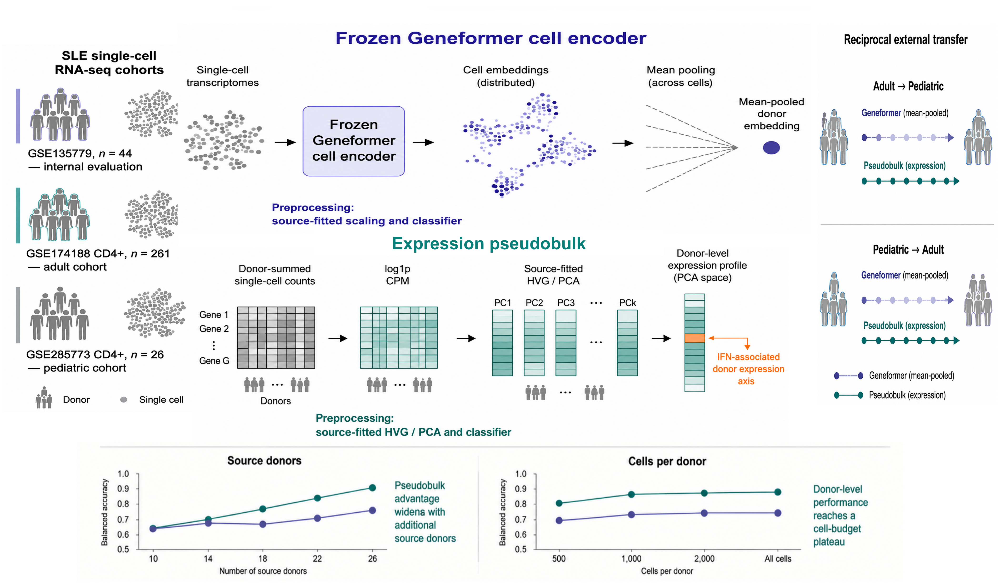
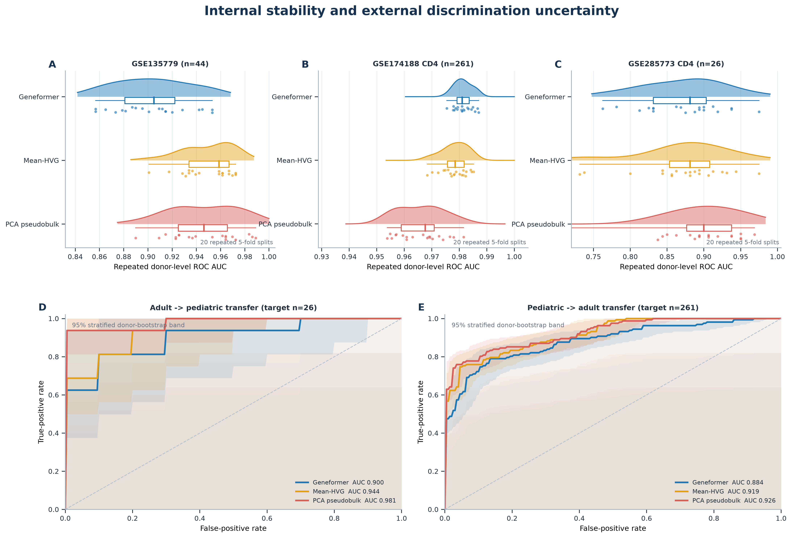
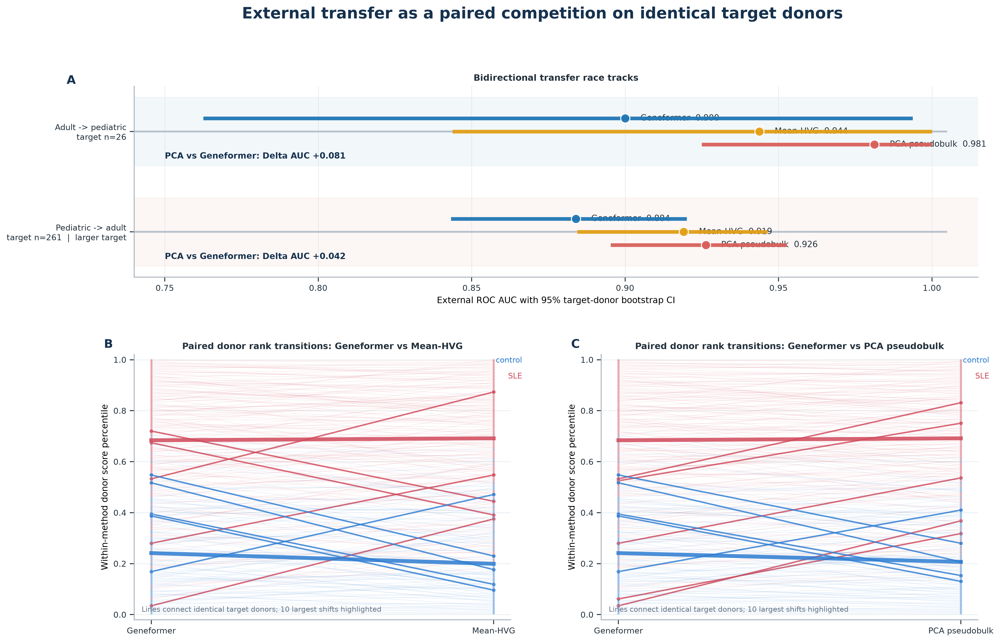
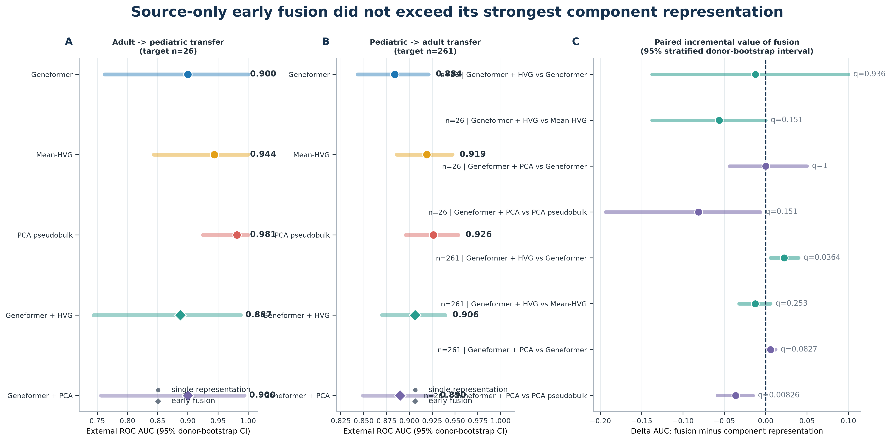
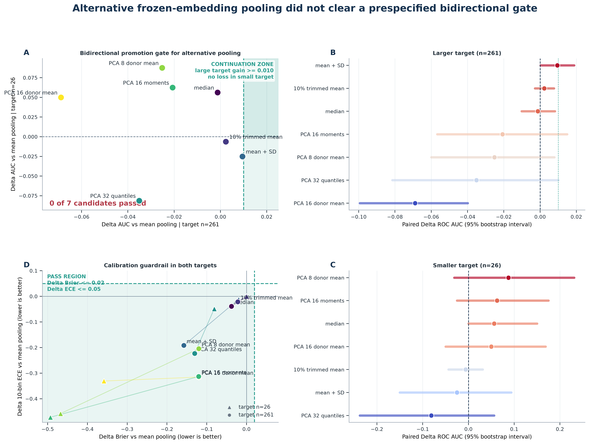
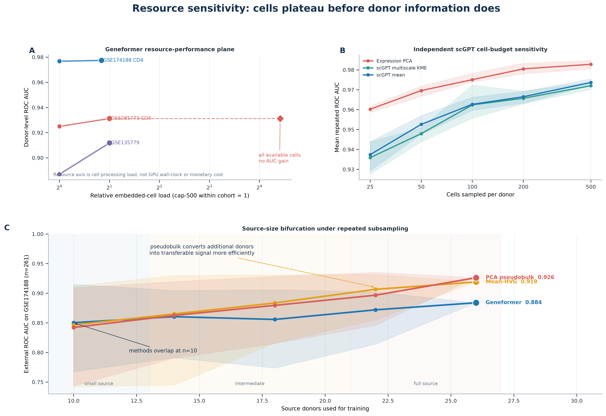
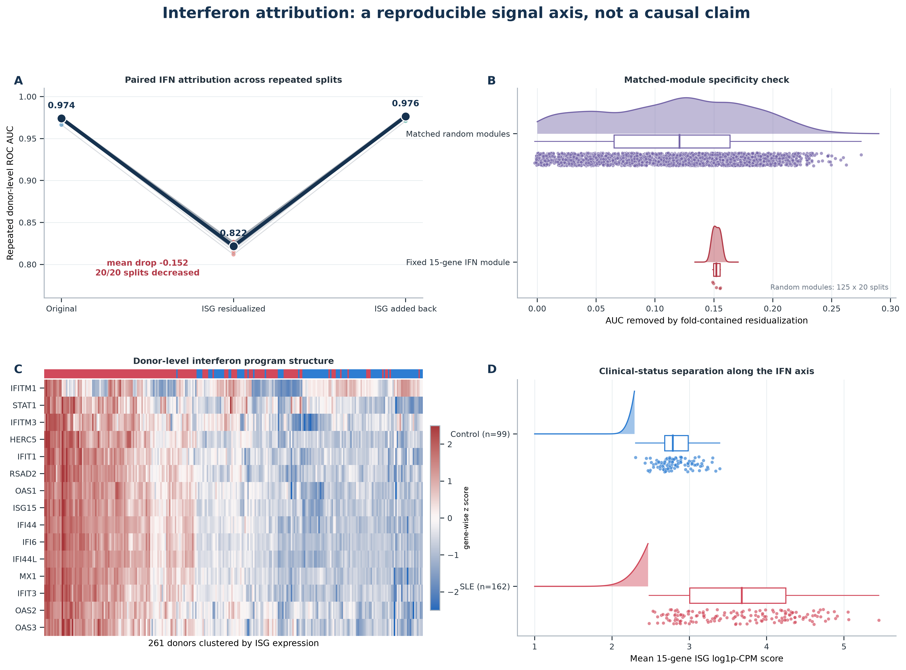
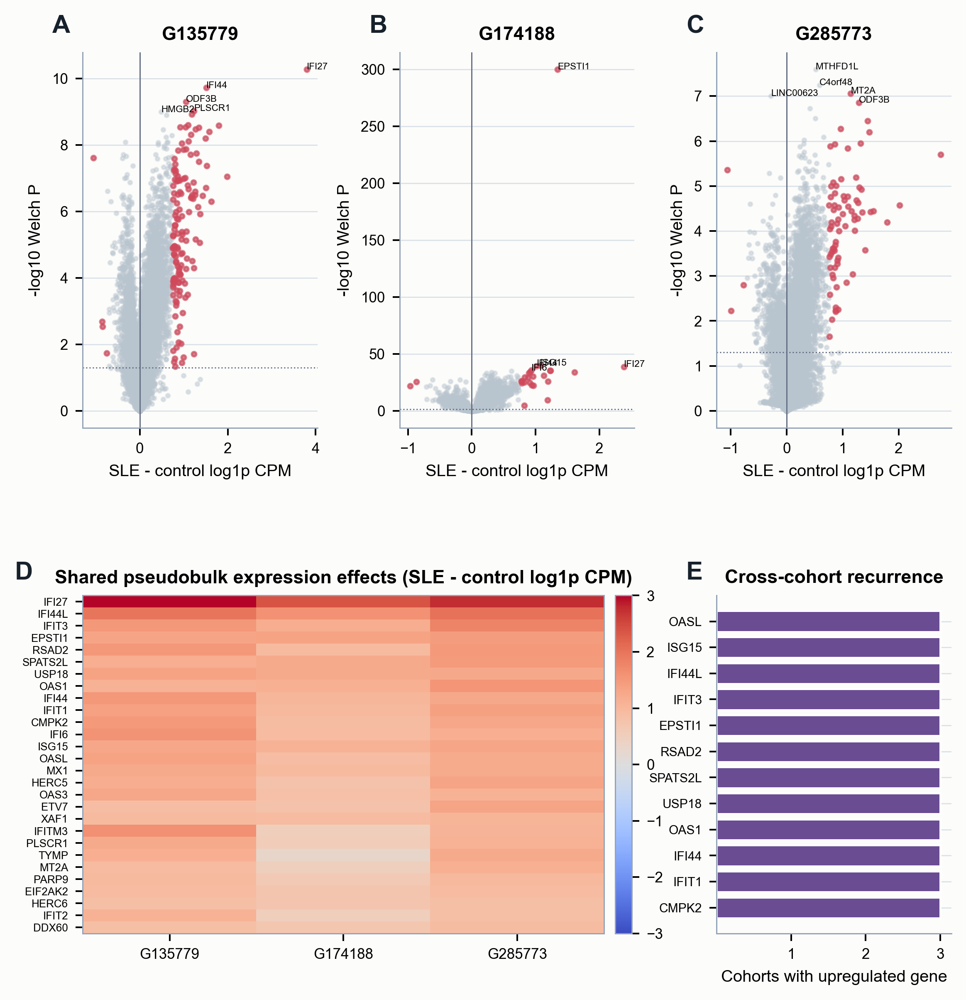

# Cross-Cohort Benchmarking of Frozen Geneformer and Expression Pseudobulk for Donor-Level SLE Classification

**Article Type:** Article

Hongyu Ying1, Dandan Yun1 and Dan Liu1,*

1 Department of Rheumatology and Immunology, Shanghai Pudong Hospital, Fudan University Pudong Medical Center, Shanghai 201399, China

* Correspondence: Dan Liu; danliu600@126.com

## Abstract

Patient-level classifiers derived from single-cell RNA sequencing must preserve disease information across cohorts, yet most representation comparisons remain within-dataset. We benchmarked mean-pooled frozen Geneformer embeddings against highly variable gene (HVG) and principal-component pseudobulk for systemic lupus erythematosus classification in three cohorts comprising 44, 261, and 26 donors. Evaluation used 20 repeated donor-level five-fold cross-validations and reciprocal external transfer between the two CD4-positive cohorts, with scaling, feature selection, dimensionality reduction, and regularization fitted exclusively in training donors. Internal ordering varied by cohort after fold-contained scaling and regularization selection, although all representations retained strong discrimination. When the 261-donor cohort served as target, HVG and PCA pseudobulk achieved AUCs of 0.919 and 0.926, compared with 0.884 for Geneformer. Source-only fusion and seven fixed distribution-preserving pooling alternatives produced no stable bidirectional improvement. Source-size curves indicated that the pseudobulk advantage widened as training donors accumulated, while cell-budget analyses showed little gain beyond 500-1000 cells per donor. Interferon-program residualization reduced Geneformer discrimination, linking predictive signal to structured SLE expression. External scores measured discrimination rather than calibrated clinical risk. Under frozen, fixed-pooling conditions, source-fitted pseudobulk provided the stronger transferable donor representation and a practical benchmark for future learned patient models.

**Keywords:** single-cell RNA sequencing; systemic lupus erythematosus; Geneformer; pseudobulk; patient-level prediction; cross-cohort transfer; foundation models; bioinformatics benchmarking

## Introduction

Systemic lupus erythematosus (SLE) is a heterogeneous autoimmune disease, and a blood type I interferon signature is a well-recognised disease marker (Baechler et al., 2003; Bennett et al., 2003; Rönnblom and Leonard, 2019). Single-cell RNA sequencing can resolve the immune-cell states that underlie this heterogeneity. Yet diagnosis, treatment response, and prognosis are assigned to patients, whereas the measurement is made in individual cells. This patient-cell mismatch is the central representation problem for clinical single-cell studies.

Cells from the same donor are correlated subsamples of one biological replicate (Zimmerman et al., 2021). A donor-level representation is therefore needed whenever single-cell measurements are used to study a clinical phenotype. Pseudobulk aggregation is an established way to preserve the donor as the unit of inference (Crowell et al., 2020; Squair et al., 2021).

Many donor-level representations have been proposed. Supercell analyses average cells to reduce measurement variability (Candia et al., 2013). CloudPred learns a phenotype model from variable-size cell sets and has been applied to lupus classification (He et al., 2022). scFeatures combines composition, cell-type-specific expression, pathways, and interactions (Cao et al., 2022). Other approaches model the distribution of cellular states or multicellular programs (Chen et al., 2020; Ramirez Flores et al., 2023; Joodaki et al., 2024). Together, these approaches focus attention on the donor representation that remains effective in an independent cohort.

A pretrained cell model offers a simple alternative to training a new donor-level architecture. Geneformer encodes cell transcriptomes with a pretrained transformer and supports downstream biological prediction (Theodoris et al., 2023). scGPT and scFoundation illustrate the rapid expansion of pretrained single-cell representations (Cui et al., 2024; Hao et al., 2024). Here, we average the frozen Geneformer embeddings of a donor's cells. This permutation-invariant summary is simple, inexpensive, and directly comparable across donors. Its value, however, must be demonstrated against expression pseudobulk, which is a strong donor-level baseline. We also report scVI donor means as a secondary within-cohort comparator (Lopez et al., 2018).

The decisive test is cross-cohort transfer. A molecular classifier has translational relevance only if it retains discrimination when hospital, sequencing chemistry, and patient population change; same-distribution accuracy alone cannot establish this. We therefore make reciprocal transfer between adult and pediatric CD4-positive SLE cohorts the primary evaluation target. These cohorts differ along multiple co-occurring biological and technical axes, so age is one component of the shift rather than its sole explanation. Integration benchmarks show that reducing batch effects can also remove biological variation (Luecken et al., 2022). We therefore evaluate a source-only transfer setting: feature selection, scaling, PCA, and classifier tuning are learned in the training cohort and then applied unchanged to the target cohort. This design asks a direct question: which donor representation best preserves SLE discrimination after cohort shift?

We compare mean-pooled Geneformer embeddings with HVG and PCA pseudobulk in three public SLE cohorts. The study contributes four linked advances. First, bidirectional external transfer with source-fitted preprocessing and paired, multiplicity-adjusted inference reveals a representation ranking that internal accuracy alone does not establish. Second, source-size learning curves and source-only fusion determine when the pseudobulk advantage appears and whether Geneformer adds transferable information beyond expression. Third, a direct reciprocal transfer experiment tests whether retaining cell-embedding dispersion, quantiles, or low-dimensional moments repairs mean pooling. Fourth, interferon residualisation, matched modules, nested cell budgets, and a full-cell probe connect discrimination to a recognised SLE axis while defining practical resource plateaus. Together, these analyses turn donor representation choice into a testable external-validation problem.

Recent work makes this distinction especially timely. PaSCient learns multicellular patient representations at atlas scale, and a broad cancer benchmark shows that aggregation strategy and simple expression baselines can materially alter patient-level foundation-model rankings (Liu et al., 2026; Elmarakeby et al., 2025). CloudPred and related methods have already established that learned cell-set models can predict lupus phenotypes (He et al., 2022). What remained unresolved was whether a frozen cell foundation model retains an advantage under label-blind, source-fitted transfer between independent autoimmune cohorts, and whether any embedding signal is incremental to pseudobulk. This study supplies that external test and links its outcome to source sample size, biological programs, and compute budgets.

**Figure 1. From single cells to transferable patient-level signals.** Three SLE cohorts contributed 44, 261, and 26 donors. Cell-level transcriptomes entered one of two fixed representation paths: frozen Geneformer cell embeddings followed by donor mean pooling, or source-fitted expression pseudobulk followed by a donor-level classifier. Adult-to-pediatric and pediatric-to-adult transfer used identical target donors for all methods. Pseudobulk preserved cross-cohort discrimination more strongly as source-donor information increased.

## Materials and Methods

### Cohorts and study design

We reanalysed three public SLE scRNA-seq datasets: `GSE135779` (44 donors: 33 cases and 11 controls), `GSE174188_CD4` (261 donors: 162 cases and 99 controls), and `GSE285773_CD4` (26 donors: 16 cases and 10 controls). GSE135779 profiled SLE heterogeneity (Nehar-Belaid et al., 2020), GSE174188 used multiplexed single-cell profiling (Perez et al., 2022), and GSE285773 profiled pediatric SLE CD4-positive T cells (Balasubramanian et al., 2025). We used the two CD4-positive cohorts for bidirectional transfer. Donors were the statistical unit in every supervised analysis; all cells from a donor remained in the same fold (Zimmerman et al., 2021; Crowell et al., 2020). Supplementary Table S19 reports available case-control demographic and sequencing/QC characteristics with standardized differences and missingness. Metadata availability was uneven: GSE285773 provided donor-level cell yield and QC summaries but not harmonized age, sex, treatment, disease activity, ancestry, or batch fields.

The primary representation used Geneformer V2-316M, a cap of 1000 sampled cells per donor, and maximum sequence length 4096. The checkpoint was `ctheodoris/Geneformer` revision `04c2b2e84da7c0f385c3f9ad8f3ec24bab6650e5`. Raw counts were normalized within cell to 10,000, divided gene-wise by the Geneformer median dictionary, and ranked in descending order with stable tie handling. After Ensembl mapping and duplicate removal, at most 4094 gene tokens were retained between token IDs 2 and 3 (`[CLS]` and `[SEP]`). We passed these sequences through the frozen checkpoint and extracted the 1,152-dimensional first-token vector from the final hidden layer (`last_hidden_state[:,0,:]`), then averaged vectors within donor. The token dictionary, gene-median dictionary, and gene-name mapping corresponded to the `gc104M` release; their SHA256 values and the executable extraction script are included in the provenance archive. The main comparators were mean-HVG pseudobulk and PCA pseudobulk. Dataset-specific scVI donor means appear only in the archived fixed-split reference panels.

### Internal evaluation and statistical inference

The final internal analysis repeated stratified five-fold donor-level cross-validation 20 times. Split seeds were the integer sequence 20260801 through 20260820; these identifiers are random-number seeds, not dates. Every method used the same donor assignments in each repeat. Within each outer training fold, the 4,000 highest-variance genes were selected, all final classifier feature blocks were standardized with training-donor means and standard deviations, and PCA was fitted on training donors only. Balanced liblinear logistic regression selected `C` from 10^-4 to 10^4 by five-fold inner source-donor cross-validation. We report repeat-level ROC-AUC means, standard deviations, and 2.5th-97.5th percentiles to show sensitivity to donor splits; full summaries appear in Supplementary Table S20. The archived unscaled fixed-`C=1` comparison is retained in Supplementary Figures S14 and S16 as an implementation sensitivity rather than the primary internal ranking. The original five-fold split (`StratifiedKFold(n_splits=5, shuffle=True, random_state=1)`) was used for the cell-budget and interferon analyses. PR-AUC (Saito and Rehmsmeier, 2015), Brier score (Brier, 1950), and 10-bin expected calibration error (ECE) were secondary metrics. ECE used 10 equal-width probability bins (Guo et al., 2017; Van Calster et al., 2019).

For fixed-split and transfer predictions, we calculated ROC-AUC intervals from 5,000 case/control-stratified target-donor bootstrap resamples using the percentile method (Efron and Tibshirani, 1993). Transfer intervals are conditional on the single fitted source model and therefore quantify target-donor sampling uncertainty, not source-model refitting uncertainty. Paired DeLong tests compared representations on the same target donors (DeLong et al., 1988). We adjusted the four primary transfer comparisons with the Benjamini-Hochberg procedure (Benjamini and Hochberg, 1995). Repeated internal results are summarized as performance distributions because repeats reuse the same donors.

### Cross-cohort transfer and cell-budget sensitivity

For each CD4-positive transfer direction, we trained logistic regression in the source cohort and evaluated it once in the independent target cohort. Pseudobulk inputs were donor-specific `log1p(1e6 * summed raw counts / donor library size)` matrices. Target-unlabelled feature-schema harmonisation used the exact intersection of whitespace-trimmed, unique retained identifiers; no target expression values or labels entered feature ranking. The source cohort then selected the 4,000 greatest population-variance genes, fitted scaling and up to 30 PCs (24 when the 26-donor cohort was the source), and selected `C` from 10^-4 to 10^4 by stratified cross-validation. We applied these transformations and the classifier unchanged to the target cohort. Geneformer vectors were scaled with source-cohort statistics. Target-centered and target-z-scored analyses are reported separately as transductive sensitivity analyses.

Because the archived primary transfer selected regularisation with method-specific source-internal folds, we performed an additional label-blind sensitivity in which all three representations shared the same source-internal donor folds. No target labels, target expression summaries, or target-fitted transformations entered this sensitivity. It was used to test whether method ordering depended on the internal fold assignment and was not substituted post hoc for the prespecified primary estimates.

To test incremental information, we concatenated source-scaled Geneformer with either source-HVG or source-PCA pseudobulk, rescaled the combined block on source donors, and selected regularisation by the same source-only cross-validation. The target cohort was transformed with source-fitted parameters. We compared each hybrid with its pseudobulk component and with Geneformer on identical target donors; eight paired DeLong tests were Benjamini-Hochberg adjusted.

We evaluated Geneformer embeddings generated with fixed sampling seeds and caps of 200, 500, and 1000 cells per donor. The matched 500-versus-1000 analysis used the same donors, labels, and folds at both caps. In GSE285773, an additional all-available-cell run used 277,051 cells, compared with 26,000 cells at the 1,000-cell cap. We report bootstrap intervals for AUC differences, paired DeLong tests adjusted across the three cohorts, donor-score Spearman correlations, and embedding similarity. The 200-to-1000-cell transfer results are shown as supplementary sensitivity analyses because they used a historical transfer workflow.

For the GSE285773-to-GSE174188 learning curve, we drew 40 stratified source-donor subsets without replacement at n=10, 14, 18, and 22. Feature selection, scaling, PCA, and regularisation were refitted in each subset, while the 261-donor target remained fixed and unlabeled until evaluation. The n=26 endpoint is the single prespecified full-source result rather than 40 duplicate full-cohort resamples.

### Distribution-preserving Geneformer pooling sensitivity

We directly tested whether ordinary coordinate averaging discarded transferable information present in frozen Geneformer cell embeddings. This prespecified cap500 experiment used Geneformer V2-316M revision `04c2b2e84da7c0f385c3f9ad8f3ec24bab6650e5`, sampling seed 1, maximum sequence length 4096, and identical 500-cell donor samples in both reciprocal CD4-positive transfer directions. The cap500 cell embeddings reproduced the archived donor means before evaluation (median donor cosine greater than 0.999999996 in both cohorts). We compared coordinate mean with coordinate median, 10% coordinate-wise trimmed mean, mean plus standard deviation, source-fitted cell-PCA32 mean plus 10th/50th/90th quantiles, source-fitted cell-PCA16 mean plus shrunken covariance moments, and source-PCA8 or source-PCA16 donor means. Cell-state-stratified means were not evaluated because GSE285773 lacked a harmonised CD4 subtype annotation.

All operators and downstream transformations were fitted in the source cohort. Balanced logistic regression selected `C` from 10^-4 to 10^4 by five-fold stratified source-donor cross-validation, then scored the independent target donors without target-label tuning. Each candidate was compared with ordinary mean pooling on the same target donors using 5,000 case/control-stratified paired bootstrap resamples and paired DeLong tests; the 14 candidate-by-direction DeLong tests were Benjamini-Hochberg adjusted. The prespecified cap1000 continuation rule required an AUC increase of at least 0.010 in the 261-donor target, no AUC loss in the 26-donor target, and no candidate-minus-mean deterioration greater than 0.02 in Brier score or 0.05 in 10-bin ECE in either direction. No candidate met this rule, so the sequence stopped at cap500.

### Interferon-conditioned representation sensitivity

We analysed the interferon association in GSE174188 CD4-positive alpha-beta T cells. The interferon-stimulated-gene (ISG) score was the mean donor-pseudobulk log1p CPM expression of a fixed 15-gene panel: `ISG15`, `IFI6`, `MX1`, `OAS1`, `OAS2`, `OAS3`, `IFIT1`, `IFIT3`, `IFI44`, `IFI44L`, `STAT1`, `RSAD2`, `IFITM1`, `IFITM3`, and `HERC5` (Baechler et al., 2003; Bennett et al., 2003; Rönnblom and Leonard, 2019).

Within each training fold, we scaled the ISG score and fitted one linear model from the score to each of the 1,152 Geneformer coordinates. We then removed the fitted ISG-associated component from test-donor embeddings. The fixed-fold analysis compared Geneformer, ISG-only, and ISG-residualized classifiers. The 1,000-cell analysis repeated 20 stratified donor splits and added an ISG-plus-residual classifier.

To test the specificity of the association, we generated 500 non-ISG modules for each of the first five repeated splits. Each module matched the ISG panel in donor expression, variance, score variance, and mean pairwise correlation. ISG and random-module scores used all available CD4 cells per donor because exact sampled-cell identifiers were unavailable.

### Supporting analyses, software, and reproducibility

Supplementary Figure S1 reports the observed, incomplete model-size and maximum-length configurations. A separate scGPT 0.2.4 analysis evaluated 237 GSE174188 donors with ten nested within-donor samples at 25, 50, 100, 200, and 500 cells per donor. It characterizes low-cell-count performance and sampling variability. The archived whole-human checkpoint used scGPT 0.2.4 with Python 3.10 and PyTorch 2.5.1+cu124; checkpoint, vocabulary, arguments, and canonical embedding hashes are included in the provenance record.

An additional archived sensitivity used 261 GSE174188 donors, 500 cells per donor, and 30 matched donor-disjoint five-fold repeats to compare scGPT donor means, multiscale kernel mean embeddings of scGPT cell vectors, and donor-expression PCA. Because the same donors recur across splits, paired repeat differences are descriptive and no repeat-level p values are reported.

We also characterized the geometry of the cap500 donor-mean Geneformer matrices without using outcome labels for dimensionality reduction. PCA coordinates, entropy and participation effective ranks, and case-control centroid separation were calculated separately in the two reciprocal-transfer cohorts. Cell-level spectra were estimated from deterministic samples of 20,000 cap500 cell embeddings per cohort. Cap500 and cap1000 spaces were compared with raw and globally centered donor-wise cosine similarity, coordinate RMSE, and correlation between donor-distance matrices.

We additionally recovered a broad fixed-split aggregation atlas from the immutable scGPT analysis snapshot. It evaluated 22 distinct donor representations on the same 261 GSE174188 donors and the same matched 500-cell, five-fold donor split. The atlas covered expression pseudobulk, frozen scGPT mean pooling, moments and quantiles, kernel mean embeddings, prototype summaries, Deep Sets, attention and top-k multiple-instance learning, a Set Transformer, and exploratory donor-set operators. We retained exact aliases and incomplete methods in the provenance table but removed exact duplicate aliases from the plotted ranking. Paired donor bootstrap intervals compare each completed method with scGPT mean pooling. This single-cohort atlas is exploratory: it expands the tested aggregation space but does not replace the repeated internal or external-transfer analyses.

Three archived control branches were also incorporated. First, 1,000 label permutations were completed for scGPT mean, expression PCA, and multiscale KME in GSE174188; empirical p values used `(1 + number of null AUCs at least as large as observed)/(1 + 1000)`. Second, an accepted covariate sensitivity fitted training-fold residualization for cells per donor, mean UMI per cell, mean detected genes per cell, age, and sex before refitting donor classifiers. Third, descriptive kernel diagnostics recorded training-fold bandwidth, effective rank, and prediction agreement for 25-500 cells per donor. Historical Geneformer controls included 1,000 label permutations in each cohort, total-cell-count-only prediction, univariate Geneformer-PC associations with cell yield, classifier ablations, model-size/sequence-length probes, and a whole-PBMC cell-composition baseline. These branches use fixed splits and heterogeneous estimands; they are treated as supporting diagnostics.

The final cap500 Geneformer pooling experiment ran under Python 3.12.3, PyTorch 2.8.0+cu128, Transformers 4.53.2, scikit-learn 1.7.0, and CUDA 12.8. The frozen model file SHA256 was `965ceccea81953d362081ef3843560a0e4fef88d396c28017881f1e94b1246f3`. The local statistical and visualization reanalysis environment is separately locked and includes scanpy 1.12.2 and scikit-learn 1.9.0. The exact historical scanpy, scvi-tools, and scikit-learn pins used to generate the original fixed-split scVI reference were not retained and are not reconstructed retrospectively. The reproducibility package includes scripts, donor-level predictions, metrics, fold assignments, input and embedding hashes, random seeds, the Geneformer revision and model hash, the scGPT checkpoint and configuration records, and environment locks for the retained computational branches.

## Results

### All representations showed strong but preprocessing-sensitive internal discrimination

Mean-pooled Geneformer embeddings discriminated SLE cases from controls in all three cohorts. Under fold-contained scaling and inner regularization selection, mean AUC was 0.904 in GSE135779, 0.981 in GSE174188 CD4-positive cells, and 0.872 in GSE285773 CD4-positive cells (Table 1). The smallest cohort showed the widest split-to-split variation.

HVG pseudobulk achieved mean AUCs of 0.949, 0.978, and 0.872, while PCA pseudobulk achieved 0.946, 0.966, and 0.890. Thus HVG ranked first in GSE135779, Geneformer in GSE174188, and PCA pseudobulk in GSE285773. The earlier unscaled fixed-`C` pipeline favored HVG in all three cohorts, demonstrating that internal method ordering was sensitive to feature scale and regularization. All three representations remained highly discriminative; external transfer, rather than within-cohort rank, therefore provides the more stable basis for representation selection.

**Figure 2. Internal stability and external discrimination uncertainty.** Panels A-C are raincloud plots combining half-density, individual repeated-split estimates, and quartile summaries for 20 repeated stratified donor-level five-fold evaluations. All methods used identical donor assignments; feature scaling, HVG selection, PCA fitting, and regularization selection were contained within training donors. Panels D-E show source-only external ROC curves with 95% stratified target-donor bootstrap bands (1,000 visualization resamples); the wider pediatric-target bands make the small-target uncertainty visible.

Supplementary Figure S14 displays the paired repeat-level AUC differences that underlie these distributions. Supplementary Figure S15 provides label-blind donor-level projections of the three representations, and Supplementary Figure S16 brings the repeated and external AUC estimates into one forest plot.

**Table 1. Fold-scaled repeated donor-level cross-validation.** Values are mean ROC-AUC across 20 repeated stratified five-fold analyses. Intervals show the 2.5th-97.5th percentiles across repeats. Feature scaling, mean-HVG selection, PCA fitting, and regularization selection used outer-training donors only; `C` was selected from 10^-4 to 10^4 by five-fold inner cross-validation.

| Dataset | Frozen Geneformer mean AUC [P2.5-P97.5] | Mean-HVG pseudobulk mean AUC [P2.5-P97.5] | PCA pseudobulk mean AUC [P2.5-P97.5] |
| --- | --- | --- | --- |
| GSE135779 (n=44) | 0.904 [0.857-0.953] | 0.949 [0.909-0.972] | 0.946 [0.899-0.988] |
| GSE174188 CD4 (n=261) | 0.981 [0.977-0.987] | 0.978 [0.969-0.985] | 0.966 [0.954-0.980] |
| GSE285773 CD4 (n=26) | 0.872 [0.771-0.957] | 0.872 [0.734-0.960] | 0.890 [0.726-0.960] |

### Pseudobulk outperformed Geneformer in cross-cohort transfer

When GSE174188 was the source and GSE285773 was the target, Geneformer achieved AUC 0.900. HVG and PCA pseudobulk achieved higher AUCs of 0.944 and 0.981. The paired BH-adjusted p values were 0.491 and 0.106.

The reverse direction provided a larger test set. When GSE285773 was the source and GSE174188 was the 261-donor target, Geneformer achieved AUC 0.884 (95% CI 0.843-0.920). HVG and PCA pseudobulk achieved AUCs of 0.919 (0.884-0.946) and 0.926 (0.895-0.953). Paired DeLong tests on the same target donors favored both pseudobulk representations after adjustment (BH p=0.015 and 0.000603). Geneformer transferred across cohorts; pseudobulk was the stronger representation in both directions. The reciprocal transfer spans cohorts with multiple co-occurring shifts, including pediatric and adult recruitment, and shows that the disease signal generalises across the evaluated populations while remaining better preserved by pseudobulk.

Discrimination did not imply calibrated risk. In the 26-donor target (16 cases), a constant prediction equal to target prevalence has Brier score 0.237; Geneformer and HVG transfer scores were 0.615 and 0.544, whereas PCA pseudobulk reached 0.180. In the 261-donor target (162 cases), the analogous prevalence baseline was 0.235; Geneformer was 0.237 and the two pseudobulk models were 0.155 and 0.159. These probabilities are therefore model scores for ranking donors, not clinically calibrated individual risks. We did not perform prospective validation, target-population recalibration, or decision-curve analysis.

A shared-fold source-internal sensitivity analysis preserved this external ordering. In the 261-donor target, Geneformer, HVG pseudobulk, and PCA pseudobulk achieved AUCs of 0.890, 0.916, and 0.916; both paired pseudobulk comparisons remained significant after BH correction (q=0.029). The larger-target pseudobulk advantage therefore was not created by method-specific source-fold assignments (Supplementary Figure S29).

**Figure 3. Cross-cohort transfer as a paired competition on identical target donors.** Panel A places the two transfer directions on separate AUC tracks. Points and horizontal bands show target-cohort ROC-AUC and 5,000-resample donor-stratified 95% intervals. Panels B-C connect each of the 261 adult target donors across Geneformer and pseudobulk score percentiles. Color denotes case-control status, heavy lines summarize status-specific medians, and the ten largest rank shifts are highlighted. Percentiles show ordering changes and are not calibrated clinical risks.

Target-donor score distributions and the full ROC-AUC, PR-AUC, and Brier-score matrix are shown in Supplementary Figures S9-S10. Supplementary Figure S17 maps the paired target-donor probabilities assigned by Geneformer and pseudobulk, showing where the representations agree and diverge. Supplementary Figure S22 presents descriptive 10-bin reliability curves for the same strict transfer predictions.

**Table 2. Bidirectional source-only CD4-positive cohort transfer.** Feature selection, scaling, PCA, and regularization were fitted in the source cohort and applied unchanged to the target cohort. Intervals are 5,000-resample donor-stratified bootstrap percentile intervals. Paired DeLong comparisons use the same target donors and are adjusted across four tests.

| Source to target | Representation | ROC-AUC [95% CI] | PR-AUC | Brier score | Paired DeLong BH p vs Geneformer |
| --- | --- | --- | --- | --- | --- |
| GSE174188 CD4 to GSE285773 CD4 | Frozen Geneformer | 0.900 [0.762-0.994] | 0.945 | 0.615 | - |
| GSE174188 CD4 to GSE285773 CD4 | Source-HVG pseudobulk | 0.944 [0.844-1.000] | 0.966 | 0.544 | 0.4914 |
| GSE174188 CD4 to GSE285773 CD4 | Source-PCA pseudobulk | 0.981 [0.925-1.000] | 0.990 | 0.180 | 0.1061 |
| GSE285773 CD4 to GSE174188 CD4 | Frozen Geneformer | 0.884 [0.843-0.920] | 0.936 | 0.237 | - |
| GSE285773 CD4 to GSE174188 CD4 | Source-HVG pseudobulk | 0.919 [0.884-0.946] | 0.954 | 0.155 | 0.0151 |
| GSE285773 CD4 to GSE174188 CD4 | Source-PCA pseudobulk | 0.926 [0.895-0.953] | 0.960 | 0.159 | 0.000603 |

### Frozen Geneformer did not add transfer performance beyond pseudobulk under early fusion

Source-only fusion directly tested whether the frozen embedding contained transferable information that pseudobulk lacked. In the GSE174188-to-GSE285773 direction, Geneformer-plus-HVG and Geneformer-plus-PCA achieved AUCs of 0.887 and 0.900, below HVG (0.944) and PCA pseudobulk (0.981). In the reverse direction, the hybrids achieved 0.906 and 0.890, below the corresponding pseudobulk AUCs of 0.919 and 0.926. Geneformer-plus-HVG improved on Geneformer alone in the 261-donor target (difference 0.022; BH-adjusted p=0.036) but did not improve on HVG pseudobulk (difference -0.013; BH-adjusted p=0.253). Geneformer-plus-PCA was lower than PCA pseudobulk in the same direction (difference -0.036; BH-adjusted p=0.0083). Thus, frozen Geneformer carried transferable disease signal, but simple early fusion did not convert it into incremental performance beyond pseudobulk.

**Figure 4. Source-only fusion tests incremental transfer information.** Geneformer vectors were concatenated with HVG or PCA pseudobulk, then rescaled and regularised using source donors only. Panels A-B show independent-target ROC-AUC with target-donor bootstrap intervals. Panel C reports fusion-minus-component AUC differences with 5,000-resample paired stratified target-donor bootstrap intervals; labels also show paired DeLong p values adjusted across eight comparisons. Neither hybrid exceeded its corresponding pseudobulk representation.

### Distribution-preserving Geneformer pooling produced directional, not general, gains

The direct cap500 experiment tested seven alternatives to ordinary Geneformer coordinate averaging under the same reciprocal source-only transfer design (Figure 5; Table 3). Ordinary mean pooling reached AUC 0.863 when GSE285773 was the 26-donor target and 0.884 when GSE174188 was the 261-donor target. Coordinate median increased AUC by 0.056 in the smaller target but reduced AUC by 0.026 in the larger target (BH-adjusted DeLong q=0.000559 for the reduction). Source-PCA8 donor mean showed an even wider reversal, increasing AUC by 0.081 in the smaller target while decreasing it by 0.050 in the larger target (q=0.000838 for the reduction).

The 10% trimmed mean was the closest candidate to a stable gain. It increased AUC in the 261-donor target by 0.00761 (paired bootstrap 95% interval, 0.00025 to 0.01571) but decreased AUC in the 26-donor target by 0.00625. Its paired DeLong p value in the larger target was 0.041 before multiplicity adjustment and q=0.096 across all 14 exploratory comparisons. It therefore fell below the prespecified 0.010 continuation threshold and did not support a cap1000 run. Mean plus standard deviation was effectively unchanged in the larger target (difference 0.0010), while quantile and covariance summaries were directionally unstable. Several small-target models also had Brier score and ECE near 0.62 despite useful ranking. Fixed distribution summaries can therefore change which donors are ranked correctly without producing a robust bidirectional representation or calibrated clinical probabilities.

**Figure 5. Bidirectional promotion and calibration guardrails for alternative frozen-embedding pooling.** Panel A maps each fixed cap-500 candidate by its AUC change relative to ordinary mean pooling in the larger and smaller target cohorts. The shaded continuation zone required a gain of at least 0.010 in the 261-donor target without loss in the 26-donor target. Panels B-C order the paired AUC differences and 5,000-resample bootstrap intervals in each direction. Panel D reports candidate-minus-mean changes in Brier score and 10-bin ECE; the prespecified calibration guardrail excluded deterioration greater than 0.02 in Brier score or 0.05 in ECE in either target. No candidate passed the complete bidirectional gate.

**Table 3. Fixed Geneformer pooling under reciprocal source-only transfer at 500 cells per donor.** Parentheses give the AUC difference from coordinate mean in the same target. Paired DeLong q values are Benjamini-Hochberg adjusted across seven candidates and two directions (14 tests). The continuation rule required an AUC gain of at least 0.010 in the 261-donor target, no loss in the 26-donor target, and the prespecified calibration bounds.

| Pooling operator | Target n=26 AUC (difference) | q | Target n=261 AUC (difference) | q | Continued to cap1000 |
| --- | --- | --- | --- | --- | --- |
| Coordinate mean | 0.863 (reference) | - | 0.884 (reference) | - | - |
| Coordinate median | 0.919 (+0.056) | 0.306 | 0.858 (-0.026) | 5.59e-4 | No |
| 10% trimmed mean | 0.856 (-0.006) | 0.745 | 0.892 (+0.008) | 0.0960 | No |
| Mean plus standard deviation | 0.825 (-0.037) | 0.661 | 0.885 (+0.001) | 0.923 | No |
| Source-PCA32 quantiles | 0.781 (-0.081) | 0.371 | 0.823 (-0.062) | 0.00604 | No |
| Source-PCA16 moments | 0.925 (+0.063) | 0.307 | 0.839 (-0.046) | 0.0613 | No |
| Source-PCA8 donor mean | 0.944 (+0.081) | 0.307 | 0.834 (-0.050) | 8.38e-4 | No |
| Source-PCA16 donor mean | 0.913 (+0.050) | 0.478 | 0.784 (-0.100) | 8.79e-6 | No |

### Resource scaling and aggregation reached clear performance plateaus

In the matched Geneformer analysis, increasing the cap from 500 to 1000 cells changed AUC by 0.0248 in GSE135779, 0.0006 in GSE174188 CD4, and 0.0063 in GSE285773 CD4. The corresponding bootstrap intervals were 0.0028-0.0551, -0.0019-0.0036, and -0.0313-0.0500. BH-adjusted paired p values were 0.123, 0.692, and 0.692. Donor-level scores remained highly correlated at the two caps (Spearman rho 0.989, 0.999, and 0.995).

The independent scGPT analysis showed the complementary low-cell-count trend in GSE174188 CD4. On 237 donors, scGPT donor-mean AUC increased from 0.937 at 25 cells to 0.963 at 100 cells and 0.974 at 500 cells across ten nested samples. Sampling variability decreased from 0.010 to 0.002. Expression PCA improved from 0.960 to 0.983 and remained the best-performing representation at every cap (Supplementary Figure S3).

Two archived analyses extended the upper and algorithmic bounds. In GSE285773, increasing Geneformer input from 26,000 cells at the 1,000-cell cap to all 277,051 available cells left AUC unchanged at 0.931 and preserved donor ranking (Spearman rho=0.9993; median embedding cosine=0.999990). In the 261-donor, 30-repeat GSE174188 sensitivity, scGPT mean pooling achieved mean AUC 0.9773, multiscale kernel mean embedding achieved 0.9747, and expression PCA achieved 0.9858. Expression PCA exceeded scGPT mean in 30/30 matched repeats, whereas kernel mean embedding exceeded scGPT mean in 6/30. More cells and a distribution-aware fixed pooling operator therefore did not automatically improve the donor representation (Supplementary Figure S23).

Supplementary Figure S1 shows model-size and maximum-length implementation sensitivity.

**Figure 6. Resource sensitivity: cells plateau before donor information does.** Panel A plots donor-level Geneformer AUC against relative embedded-cell load within each cohort; the all-available-cell probe increased processing more than tenfold beyond the 1,000-cell cap without changing AUC. Panel B shows repeated scGPT, multiscale KME, and expression-PCA performance from 25 to 500 cells per donor. Panel C shows external AUC under repeated source-donor subsampling. The methods were close at 10 source donors, whereas pseudobulk increasingly converted additional donors into transferable discrimination. Relative cell load is a resource indicator, not a cross-hardware wall-clock or monetary cost.

To test whether the external advantage depended on the small source cohort, we repeatedly subsampled the 26 GSE285773 donors and transferred to the fixed 261-donor GSE174188 target. At 10 source donors, mean target AUCs were closely matched (Geneformer 0.850, HVG pseudobulk 0.847, PCA pseudobulk 0.842). By 22 source donors, the corresponding means were 0.872, 0.907, and 0.897. The single prespecified full-source endpoint reached 0.884, 0.919, and 0.926. The widening separation shows that pseudobulk converted additional source donors into external discrimination more effectively in this cohort pair (Supplementary Figure S18).

The donor-mean Geneformer geometry was markedly lower-dimensional than the sampled cell space. Entropy effective rank was 6.8 and 6.7 for the two donor-mean matrices, compared with 51.4 and 31.8 in the sampled cell spectra. Nevertheless, cap500 and cap1000 donor geometries were nearly identical: centered cosine medians were 0.998 and 0.993, and donor-distance-matrix correlations were 0.999 and 0.997. These findings distinguish a stable cell-budget plateau from evidence that coordinate averaging retains the full cell-level geometry (Supplementary Figure S30).

### A broad aggregation atlas reinforced the strength of simple donor summaries

The recovered GSE174188 atlas widened the comparison from three primary representations to 22 distinct aggregation strategies under one matched fixed split (Supplementary Figure S24; Table 4). Raw pseudobulk ranked first (AUC 0.988), followed by expression PCA (0.986), mean-HVG pseudobulk (0.984), scGPT mean pooling (0.978), and multiscale KME (0.978). Attention MIL reached 0.970, top-k MIL 0.969, Deep Sets 0.960, and the Set Transformer 0.954. Their paired AUC differences from scGPT mean were -0.0084, -0.0096, -0.0184, and -0.0241, respectively; the bootstrap intervals excluded zero for Deep Sets and the Set Transformer but not attention or top-k MIL. Distribution summaries such as quantiles, tail fractions, and prototype histograms also failed to exceed mean pooling.

The associated historical three-cohort matrix contained 58 completed method records spanning expression, Geneformer, and scGPT branches (Supplementary Figure S25). Although the matrix combines different historical implementation branches and has missing method-by-cohort cells, its pattern was consistent with the primary result: raw or PCA/HVG pseudobulk occupied the top tier in the large cohort and in the 26-donor cohort, while several more elaborate aggregators were competitive in the 44-donor cohort but did not establish a stable global advantage. The maximal atlas therefore identifies learned pooling as a plausible future direction while showing that architectural complexity alone is not the missing source of transportability.

**Table 4. Leading methods in the recovered GSE174188 aggregation atlas.** All methods used the same 261 donors, matched 500-cell estimand, and fixed five-fold donor split. Values are descriptive fixed-split metrics. The full 22-method ranking and all paired bootstrap intervals appear in Supplementary Figure S24 and the accompanying result table.

| Method | Family | ROC-AUC | PR-AUC | Brier score |
| --- | --- | --- | --- | --- |
| Raw pseudobulk | Expression | 0.988 | 0.993 | 0.054 |
| Expression PCA | Expression | 0.986 | 0.992 | 0.054 |
| Mean-HVG pseudobulk | Expression | 0.984 | 0.991 | 0.055 |
| scGPT mean pooling | Frozen embedding | 0.978 | 0.988 | 0.062 |
| Multiscale KME | Distribution summary | 0.978 | 0.986 | 0.056 |
| Attention MIL | Learned pooling | 0.970 | 0.984 | 0.064 |
| Weighted calibrated KME | Distribution summary | 0.970 | 0.979 | 0.065 |
| Count-calibrated KME | Distribution summary | 0.970 | 0.978 | 0.064 |
| Top-k MIL | Learned pooling | 0.969 | 0.982 | 0.066 |
| Mean plus variance | Distribution summary | 0.967 | 0.965 | 0.066 |

### Null, covariate, and representation diagnostics bounded alternative explanations

Formal 1,000-permutation tests in GSE174188 gave empirical p=0.000999 for scGPT mean (observed AUC 0.978), expression PCA (0.986), and multiscale KME (0.978), confirming that the fixed-split discrimination was far beyond label-randomized performance (Supplementary Figure S26). Independent Geneformer permutation controls across the three cohorts likewise yielded empirical p values from 0.000999 to 0.001998 against the archived pipeline AUCs.

Available technical and demographic variables were themselves predictive in GSE174188 (covariates-only AUC 0.789). Training-fold residualization attenuated scGPT mean from 0.978 to 0.913, expression PCA from 0.986 to 0.885, and mean-HVG pseudobulk from 0.984 to 0.916 (Table 5). Thus, measurable donor and technical structure explained a meaningful component of all three representations, but substantial disease discrimination remained after adjustment. This is a sensitivity result rather than evidence of causal independence because medication, disease activity, ancestry, processing centre, and other covariates were unavailable or too sparse.

Kernel diagnostics further clarified why a stable distribution-aware operator need not add predictive information. Multiscale KME bandwidths remained within 7.55-7.65 across five folds and five cell caps, and its predictions were distinct from scGPT mean at every cap. However, effective rank remained only 2.6-2.8 out of up to 512 diagnostic points, indicating a strongly concentrated kernel spectrum (Supplementary Figure S27). Geneformer PC1 also showed substantial association with log total cell yield in GSE135779 (R2=0.27) and GSE285773 (R2=0.66), whereas the same association was weaker in GSE174188. Total cell count alone reached AUC 0.810, 0.693, and 0.319 in the three cohorts, below Geneformer in every cohort; the unmatched whole-PBMC composition baseline reached AUC 0.912 in GSE174188 (Supplementary Figure S28). These controls show that nuisance structure is present and measurable without reducing the donor-level result to a single technical proxy.

**Table 5. Archived GSE174188 covariate sensitivity.** Available covariates were cells per donor, mean UMI per cell, mean detected genes per cell, age, and sex. Residualization and downstream preprocessing were fitted within each training fold. Unadjusted values are from the matched archived fixed-split atlas.

| Representation | Unadjusted ROC-AUC | Covariate-residualized ROC-AUC | Change |
| --- | --- | --- | --- |
| scGPT mean pooling | 0.978 | 0.913 | -0.065 |
| Expression PCA | 0.986 | 0.885 | -0.100 |
| Mean-HVG pseudobulk | 0.984 | 0.916 | -0.068 |
| Technical/demographic covariates only | - | 0.789 | - |

### Geneformer discrimination was associated with an interferon-related expression axis

The donor ISG score separated cases from controls with AUC 0.854 (95% CI 0.809-0.897), consistent with the established SLE interferon signature (Baechler et al., 2003; Bennett et al., 2003; Rönnblom and Leonard, 2019). At 1000 cells, Geneformer AUC was 0.977 (0.960-0.991). Removing the linear ISG-associated component reduced AUC to 0.818 (0.765-0.868); the 500-cell analysis gave 0.819 (0.768-0.868). Across 20 repeated donor splits, residualization decreased AUC in every split (mean change -0.152), whereas adding the ISG score back restored discrimination. Matched random expression modules produced decreases of similar magnitude (empirical p=0.307-0.337), linking Geneformer discrimination to broad structured expression (Supplementary Figures S7-S8) and connecting its discrimination to an interferon axis familiar in SLE care. The donor-by-gene heatmap in Supplementary Figure S20 makes this coordinated ISG gradient visible across the GSE174188 donor set.

**Figure 7. Interferon attribution across repeated splits and donors.** Panel A connects the same 20 repeated donor splits before residualization, after fold-contained removal of the fixed 15-gene ISG score, and after adding the ISG score back. All residualized estimates declined. Panel B compares the AUC removed by the fixed IFN module with the distribution from 125 expression-matched random modules across repeated splits. Panel C clusters donor-level standardized expression of the 15 ISGs and annotates case-control status. Panel D shows donor-level ISG-score distributions. Residualization is an attribution sensitivity analysis, not causal mediation.

### Pseudobulk recovered established interferon-associated SLE genes

Pseudobulk summaries recovered established SLE-associated interferon genes, including `IFI27`, `IFI44L`, `IFIT3`, `IFI6`, `RSAD2`, and `OAS1`. These recurring expression differences provide a biological explanation for the strong performance of donor-level pseudobulk. Supplementary Figure S19 shows both the cohort-specific effect-size and significance landscape and the overlap of high-effect genes; Supplementary Figure S21 shows that fixed-fold donor rankings were highly correlated across all four representations despite their performance differences.

**Figure 8. Pseudobulk recovers SLE-associated interferon genes.** Cohort-level differential summaries identify recurring interferon-associated expression patterns across cohorts.

Supplementary Figure S12 presents the recurring high-effect genes together with complete shared-gene effect-size comparisons.

## Discussion

This study establishes three empirical facts about donor representation under SLE cohort shift. First, mean-pooled frozen Geneformer embeddings retained strong disease signal, but pseudobulk was stronger in repeated internal evaluation and in both external directions. Second, the pseudobulk advantage expanded as source donors accumulated and was not erased by early fusion with Geneformer. Third, preserving cell-embedding dispersion, quantiles, or low-dimensional moments produced striking gains in one direction only by sacrificing the other; more cells and greater fixed pooling complexity did not automatically improve donor discrimination. Representation choice is therefore a cross-centre generalisation and information-efficiency problem, not a contest in same-dataset accuracy or model scale.

Several features of the data may explain the pseudobulk advantage. SLE case-control separation in blood is strongly reflected in average donor expression, including reproducible interferon-associated genes. Pseudobulk preserves these donor-level shifts in a shared gene space. Coordinate-wise averaging of cell embeddings compresses each donor into a single vector and removes information about the distribution of cellular states, rare populations, and cell-state interactions. The reciprocal pooling experiment shows, however, that restoring generic dispersion or quantile information is not sufficient: those summaries amplified cohort-specific structure as readily as transferable disease structure. Geneformer pretraining optimizes cell-level transcriptomic representation, whereas donor-level disease discrimination depends on aggregate expression and cellular composition. These differences offer a plausible explanation for the cross-cohort advantage of pseudobulk.

Geneformer nevertheless has practical value. It achieved high AUC within every cohort and transferred above chance in both directions using its original pretrained weights. Mean pooling is inexpensive and provides a common feature space for heterogeneous cell collections. The fusion result clarifies its role: in these cohorts, the embedding was a competent standalone representation but did not supply stable incremental transfer information beyond pseudobulk. The resulting selection rule is concrete: benchmark frozen embeddings against source-fitted pseudobulk on an independent cohort, and require a hybrid or learned representation to demonstrate added external performance rather than assume complementarity.

The resource and interferon analyses add two further insights. Performance and sampling stability improved rapidly between 25 and 100 cells, changed little from 500 to 1,000 cells, and were effectively unchanged when the small cohort expanded from 26,000 sampled cells to all 277,051 available cells. The cap500 Geneformer experiment and the matched 30-repeat scGPT analysis independently show that a more elaborate fixed distributional summary is not sufficient by itself. The interferon analysis showed that Geneformer discrimination is strongly associated with a familiar SLE program: removing the linear ISG-associated component consistently reduced AUC, and adding the score back restored performance. The matched-module result places that finding in context: IFN is a biologically recognisable instance of a broader structured expression axis, not a uniquely isolated causal explanation. Relating predictive performance to this established disease program improves biological interpretability without overstating mechanism.

Learned patient representations now provide the most important next comparison. PaSCient demonstrates that large-scale multicellular pretraining can improve patient classification and interpretation (Liu et al., 2026), while cancer benchmarking shows that aggregation and simple baselines remain decisive (Elmarakeby et al., 2025). The direct Geneformer pooling experiment and the archived KME result sharpen this agenda: preserving more of a cellular distribution is not enough unless the representation learns disease-relevant structure that transfers in both directions. Attention-based multiple-instance learning, Set Transformers, PaSCient-like pretraining, PhEMD, and PILOT should therefore be compared with pseudobulk under the same source-only cohort-transfer protocol (Ilse et al., 2018; Lee et al., 2019; Chen et al., 2020; Joodaki et al., 2024).

The maximal historical atlas strengthens this benchmark in two ways. It shows empirically that multiple distributional and learned set operators can remain below simple pseudobulk even when all methods receive the same donor split, and it documents measurable technical attenuation rather than assuming that foundation-model embeddings are nuisance-free. These results sharpen the paper's positive increment: external transfer, incremental fusion, source-size scaling, program attribution, and a broad pooling stress test now converge on the same method-selection principle.

The calibration results delimit the applied meaning of that principle. External ROC-AUC measures whether cases tend to receive higher scores than controls; it does not make the scores transportable probabilities. The poor pediatric-target Brier scores for Geneformer and HVG show that a representation can rank donors usefully while failing as a risk model. Clinical use would require prospective sampling, explicit recalibration in the intended population, comparison with clinical predictors, and net-benefit evaluation.

## Limitations and scope

The smaller transfer target contained 26 donors, yielding wide confidence intervals and limited power for paired comparisons; the nonsignificant primary transfer direction should be interpreted accordingly. The external analysis covers two CD4-positive cohorts and cannot separate age from the other biological and technical differences between them. The primary scope is frozen Geneformer with fixed pooling; the early-fusion and cap500 pooling results do not exclude gains from fine-tuning, supervised set learning, or cell-type-aware pooling. The pooling operators were evaluated at one sampling seed and stopped at cap500 under a prespecified gate. Repeated cross-validation characterizes split sensitivity within the available donors, and transfer bootstrap intervals are conditional on one fitted source model. The scGPT analyses use distinct archived estimands and are resource or aggregation sensitivities rather than matched cross-model transfer comparisons. The interferon analysis was performed in one cohort, used all available CD4 cells for module scores, and quantifies linear association rather than causation or IFN specificity. Public metadata did not support harmonized adjustment for medication, disease activity, recruitment centre, and all technical covariates. The observed model-size and sequence-length grid is incomplete and remains descriptive. The low-rank analysis is also descriptive and does not establish that spectral contraction itself causes the transfer gap.

## Conclusion

Pseudobulk outperformed mean-pooled frozen Geneformer embeddings in reciprocal cohort transfer, while internal method ordering depended on feature scaling and regularization. Neither early fusion nor distribution-preserving fixed pooling produced a bidirectionally stable improvement. The methodological implication is direct: a patient-level molecular representation should be selected by its ability to preserve disease ranking across cohorts, not by model scale or one within-cohort pipeline alone. The reported scores are not calibrated clinical risks. For frozen cell embeddings with fixed aggregation, source-fitted pseudobulk is the external reference to beat; learned patient representations should demonstrate incremental value under the same protocol.

## Supplementary Materials

The supporting information is provided as two separate files: Figures S1-S35 with complete captions and scope notes, and Supplementary Tables S1-S20 as an indexed workbook. Reproducibility records, donor-level predictions, analysis scripts, and source data are archived under the [stable Zenodo concept DOI](https://doi.org/10.5281/zenodo.20813922) and [public GitHub repository](https://github.com/LightChainr/rheumlens).

## Author Contributions

Conceptualization, H.Y. and D.L.; methodology, H.Y.; software, H.Y.; validation, H.Y. and D.Y.; formal analysis, H.Y.; data curation, H.Y.; writing-original draft preparation, H.Y.; writing-review and editing, D.Y. and D.L.; visualization, H.Y.; supervision, D.L.; project administration, D.L. All authors have read and agreed to the published version of the manuscript.

## Funding

This research received no external funding.

## Institutional Review Board Statement

Not applicable. This study was a secondary analysis of publicly available, de-identified datasets and involved no new participant recruitment, intervention, specimen collection, or access to identifiable private information. Ethical approval for the original studies was reported by the source publications.

## Informed Consent Statement

Not applicable. No new participants were recruited, and the analyses used publicly available, de-identified data. Consent procedures for the original data collection were reported by the source studies.

## Data Availability Statement

All datasets analyzed in this study are publicly available from the Gene Expression Omnibus under accession numbers GSE135779, GSE174188, and GSE285773. Processed donor-level representations, fixed cross-validation splits, predictions, analysis scripts, software manifests, and figure source data are available under the [stable Zenodo concept DOI](https://doi.org/10.5281/zenodo.20813922) and [public GitHub repository](https://github.com/LightChainr/rheumlens).

## Acknowledgments

Not applicable.

## Conflicts of Interest

The authors declare no conflicts of interest.

## Declaration of Generative AI and AI-Assisted Technologies

During the preparation of this manuscript, the authors used OpenAI ChatGPT and Codex for code review, reproducibility checks, visualization support, manuscript restructuring, and language editing. The authors reviewed and verified all numerical results, citations, figures, and text and take full responsibility for the content of the publication.

## References

Baechler, E. C., Batliwalla, F. M., Karypis, G., et al. (2003). Interferon-inducible gene expression signature in peripheral blood cells of patients with severe lupus. *Proceedings of the National Academy of Sciences of the United States of America, 100*(5), 2610-2615. https://doi.org/10.1073/pnas.0337679100

Balasubramanian, P., Balaji, U., Santos, M. S., et al. (2025). Single-cell RNA profiling of blood CD4+ T cells identifies distinct helper and dysfunctional regulatory clusters in children with SLE. *Nature Immunology, 26*(11), 2100-2111. https://doi.org/10.1038/s41590-025-02297-2

Banchereau, R., Hong, S., Cantarel, B., et al. (2016). Personalized immunomonitoring uncovers molecular networks that stratify lupus patients. *Cell, 165*(3), 551-565. https://doi.org/10.1016/j.cell.2016.03.008

Benjamini, Y., and Hochberg, Y. (1995). Controlling the false discovery rate: a practical and powerful approach to multiple testing. *Journal of the Royal Statistical Society: Series B (Methodological), 57*(1), 289-300. https://doi.org/10.1111/j.2517-6161.1995.tb02031.x

Bennett, L., Palucka, A. K., Arce, E., et al. (2003). Interferon and granulopoiesis signatures in systemic lupus erythematosus blood. *Journal of Experimental Medicine, 197*(6), 711-723. https://doi.org/10.1084/jem.20021553

Brier, G. W. (1950). Verification of forecasts expressed in terms of probability. *Monthly Weather Review, 78*(1), 1-3. https://doi.org/10.1175/1520-0493(1950)078%3C0001:VOFEIT%3E2.0.CO;2

Cao, Y., Lin, Y., Patrick, E., Yang, P., and Yang, J. Y. H. (2022). scFeatures: multi-view representations of single-cell and spatial data for disease outcome prediction. *Bioinformatics, 38*(20), 4745-4753. https://doi.org/10.1093/bioinformatics/btac590

Candia, J., Maunu, R., Driscoll, M., et al. (2013). From cellular characteristics to disease diagnosis: uncovering phenotypes with supercells. *PLoS Computational Biology, 9*(9), e1003215. https://doi.org/10.1371/journal.pcbi.1003215

Chen, W. S., Zivanovic, N., van Dijk, D., et al. (2020). Uncovering axes of variation among single-cell cancer specimens. *Nature Methods, 17*, 302-310. https://doi.org/10.1038/s41592-019-0689-z

Crowell, H. L., Soneson, C., Germain, P.-L., et al. (2020). muscat detects subpopulation-specific state transitions from multi-sample multi-condition single-cell transcriptomics data. *Nature Communications, 11*, 6077. https://doi.org/10.1038/s41467-020-19894-4

Cui, H., Wang, C., Maan, H., et al. (2024). scGPT: toward building a foundation model for single-cell multi-omics using generative AI. *Nature Methods, 21*, 1470-1480. https://doi.org/10.1038/s41592-024-02201-0

DeLong, E. R., DeLong, D. M., and Clarke-Pearson, D. L. (1988). Comparing the areas under two or more correlated receiver operating characteristic curves: a nonparametric approach. *Biometrics, 44*(3), 837-845. https://doi.org/10.2307/2531595

Efron, B., and Tibshirani, R. J. (1993). *An introduction to the bootstrap*. Chapman & Hall/CRC.

Elmarakeby, H., Roman, A., Johri, S., and Van Allen, E. M. (2025). Empirical evaluation of single-cell foundation models for predicting cancer outcomes. *bioRxiv*. https://doi.org/10.1101/2025.10.31.685892

Guo, C., Pleiss, G., Sun, Y., and Weinberger, K. Q. (2017). On calibration of modern neural networks. *Proceedings of the 34th International Conference on Machine Learning, 70*, 1321-1330. https://proceedings.mlr.press/v70/guo17a.html

Hao, M., Gong, J., Zeng, X., et al. (2024). Large-scale foundation model on single-cell transcriptomics. *Nature Methods, 21*, 1481-1491. https://doi.org/10.1038/s41592-024-02305-7

He, B., Thomson, M., Subramaniam, M., et al. (2022). CloudPred: Predicting patient phenotypes from single-cell RNA-sequencing data. *Pacific Symposium on Biocomputing, 27*, 337-348. https://doi.org/10.1142/9789811250477_0031

Ilse, M., Tomczak, J., and Welling, M. (2018). Attention-based deep multiple instance learning. *Proceedings of the 35th International Conference on Machine Learning, 80*, 2127-2136. https://proceedings.mlr.press/v80/ilse18a.html

Joodaki, M., Shaigan, M., Parra, V., et al. (2024). Detection of PatIent-Level distances from single cell genomics and pathomics data with Optimal Transport (PILOT). *Molecular Systems Biology, 20*(2), 57-74. https://doi.org/10.1038/s44320-023-00003-8

Lee, J., Lee, Y., Kim, J., Kosiorek, A., Choi, S., and Teh, Y. W. (2019). Set Transformer: A framework for attention-based permutation-invariant neural networks. *Proceedings of the 36th International Conference on Machine Learning, 97*, 3744-3753. https://proceedings.mlr.press/v97/lee19d.html

Lopez, R., Regier, J., Cole, M. B., Jordan, M. I., and Yosef, N. (2018). Deep generative modeling for single-cell transcriptomics. *Nature Methods, 15*(12), 1053-1058. https://doi.org/10.1038/s41592-018-0229-2

Liu, T., De Brouwer, E., Verma, A., et al. (2026). Learning multi-cellular representations of single-cell transcriptomics data enables characterization of patient-level disease states. *Cell Systems, 17*(5), 101570. https://doi.org/10.1016/j.cels.2026.101570

Luecken, M. D., Büttner, M., Chaichoompu, K., et al. (2022). Benchmarking atlas-level data integration in single-cell genomics. *Nature Methods, 19*, 41-50. https://doi.org/10.1038/s41592-021-01336-8

Nehar-Belaid, D., Hong, S., Marches, R., et al. (2020). Mapping systemic lupus erythematosus heterogeneity at the single-cell level. *Nature Immunology, 21*(9), 1094-1106. https://doi.org/10.1038/s41590-020-0743-0

Perez, R. K., Gordon, M. G., Subramaniam, M., et al. (2022). Single-cell RNA-seq reveals cell type-specific molecular and genetic associations to lupus. *Science, 376*(6589), eabf1970. https://doi.org/10.1126/science.abf1970

Ramirez Flores, R. O., Lanzer, J. D., Dimitrov, D., Velten, B., and Saez-Rodriguez, J. (2023). Multicellular factor analysis of single-cell data for a tissue-centric understanding of disease. *eLife, 12*, e93161. https://doi.org/10.7554/eLife.93161

Rönnblom, L., and Leonard, D. (2019). Interferon pathway in SLE: one key to unlocking the mystery of the disease. *Lupus Science & Medicine, 6*, e000270. https://doi.org/10.1136/lupus-2018-000270

Saito, T., and Rehmsmeier, M. (2015). The precision-recall plot is more informative than the ROC plot when evaluating binary classifiers on imbalanced datasets. *PLoS ONE, 10*(3), e0118432. https://doi.org/10.1371/journal.pone.0118432

Squair, J. W., Gautier, M., Kathe, C., et al. (2021). Confronting false discoveries in single-cell differential expression. *Nature Communications, 12*, 5692. https://doi.org/10.1038/s41467-021-25960-2

Theodoris, C. V., Xiao, L., Chopra, A., et al. (2023). Transfer learning enables predictions in network biology. *Nature, 618*(7965), 616-624. https://doi.org/10.1038/s41586-023-06139-9

Van Calster, B., McLernon, D. J., van Smeden, M., et al. (2019). Calibration: the Achilles heel of predictive analytics. *BMC Medicine, 17*, 230. https://doi.org/10.1186/s12916-019-1466-7

Zaheer, M., Kottur, S., Ravanbakhsh, S., Poczos, B., Salakhutdinov, R., and Smola, A. J. (2017). Deep Sets. *Advances in Neural Information Processing Systems, 30*, 3391-3401. https://papers.nips.cc/paper/6931-deep-sets

Zimmerman, K. D., Espeland, M. A., and Langefeld, C. D. (2021). A practical solution to pseudoreplication bias in single-cell studies. *Nature Communications, 12*, 738. https://doi.org/10.1038/s41467-021-21038-1
