# Supplementary Information

## Cross-Cohort Benchmarking of Frozen Geneformer and Expression Pseudobulk for Donor-Level SLE Classification

Hongyu Ying, Dandan Yun and Dan Liu

This file contains Supplementary Figures S1-S35. Each caption states the statistical object and interpretive scope of the corresponding analysis.

## Supplementary figures

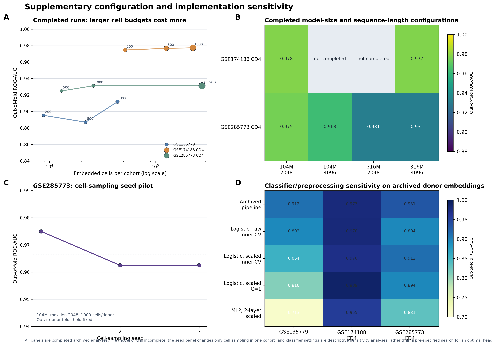

**Supplementary Figure S1. Configuration and implementation sensitivity.** Panel A relates max_len4096 embedded-cell counts to observed AUC and wall-clock GPU time (point area). Panel B displays the available portions of the model-size and maximum-sequence-length grid. Panel C varies cell-sampling seed while holding outer donor folds fixed in GSE285773. Panel D shows classifier and preprocessing sensitivity on donor embeddings.

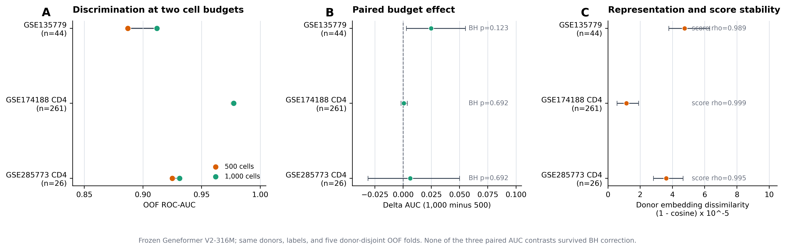

**Supplementary Figure S2. Matched Geneformer cell-budget comparison.** The analysis uses the same donors, labels, and folds at 500 and 1000 cells per donor. Panel A shows OOF AUC; panel B shows the paired 1000-minus-500 AUC difference with bootstrap intervals and BH-adjusted paired DeLong p values; panel C reports donor-embedding cosine dissimilarity and donor-score rank correlation.

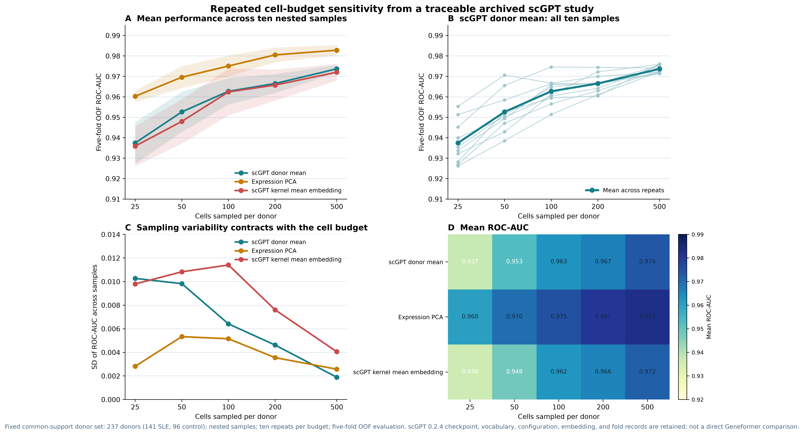

**Supplementary Figure S3. scGPT low-cell-count sensitivity in GSE174188 CD4-positive cells.** A 237-donor set (141 SLE and 96 controls) was evaluated with five donor-level folds and ten nested within-donor samples at each cap. Panels A-C show mean performance, individual scGPT donor-mean trajectories, and between-sample variability; panel D shows mean AUC across representations. The analysis used scGPT 0.2.4 with the whole-human checkpoint and provides an independent low-cell-count analysis.

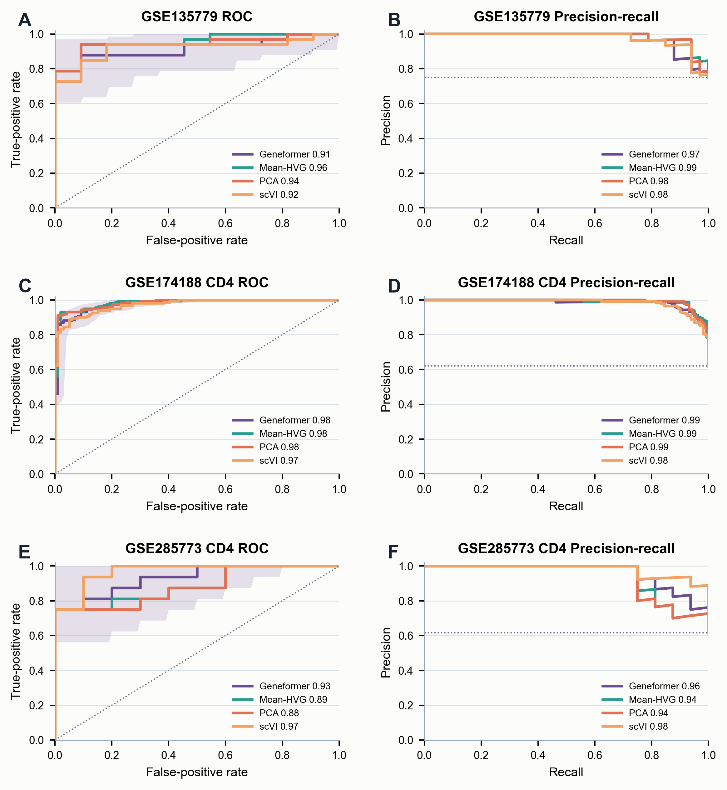

**Supplementary Figure S4. Fixed-split ROC and precision-recall curves.** Curves use donor-level out-of-fold scores for Geneformer, mean-HVG pseudobulk, PCA pseudobulk, and scVI donor means in each cohort. Shaded Geneformer ROC ribbons are 300-resample stratified donor bootstrap visualizations. The repeated internal comparison is shown in Figure 2 and Table 1.

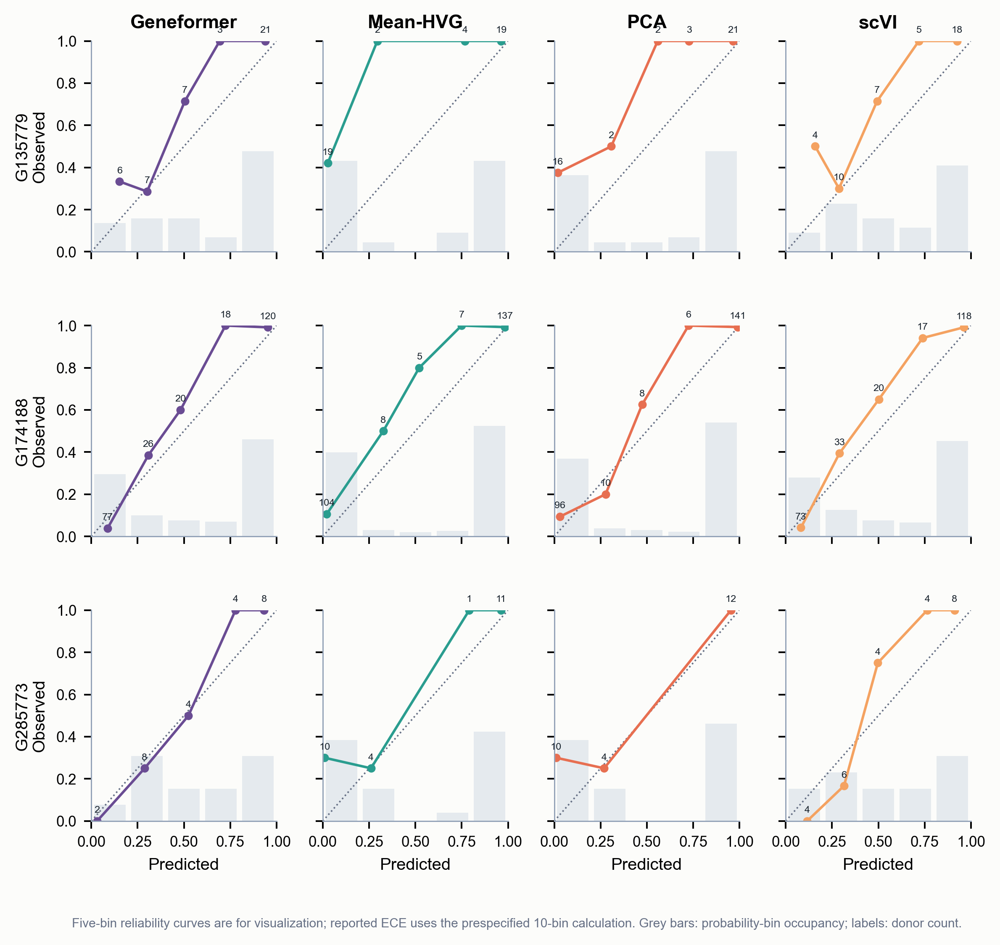

**Supplementary Figure S5. Within-cohort calibration.** Reliability curves use five display bins, and the ECE calculation uses 10 equal-width bins. Grey bars show bin occupancy and labels give donor counts.

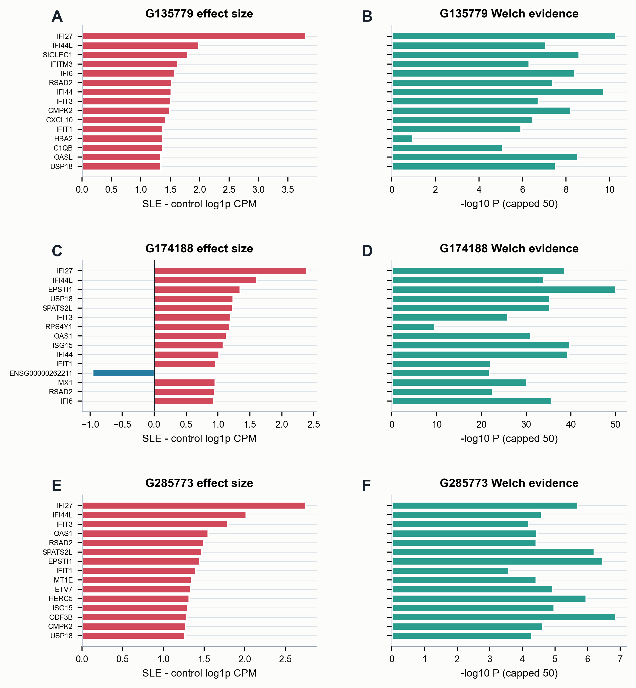

**Supplementary Figure S6. Cohort-specific pseudobulk expression rankings.** Genes are ordered by absolute SLE-minus-control donor-pseudobulk log1p CPM difference. Paired panels show two-sided donor-level Welch test evidence, capped at -log10 P = 50.

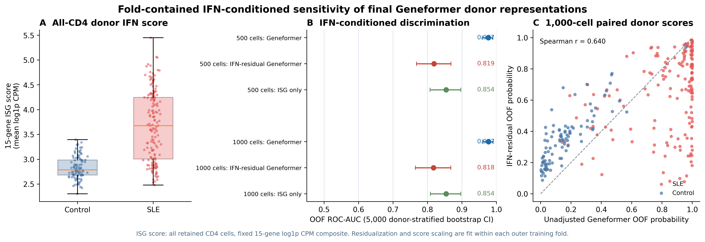

**Supplementary Figure S7. Interferon-conditioned Geneformer sensitivity in GSE174188 CD4-positive cells.** Panel A shows the fixed 15-gene all-CD4 donor ISG score. Panel B compares Geneformer, ISG-only, and ISG-residualized OOF AUC at 500 and 1000 cells. Panel C compares paired unadjusted and residualized 1000-cell donor probabilities. ISG score scaling and the coordinate-wise residual models were fitted within each outer training fold. ISG scores used all available CD4 cells per donor. Supplementary Figure S8 shows repeated-split and matched-module results.

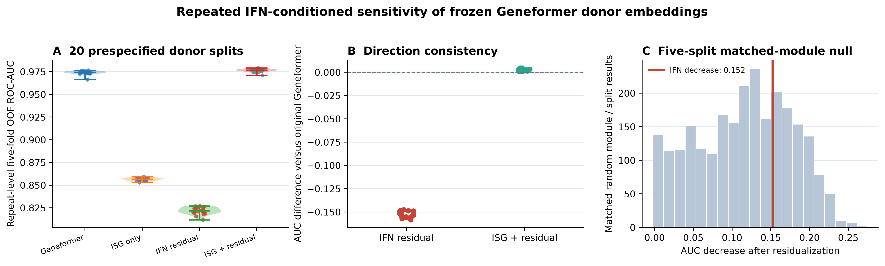

**Supplementary Figure S8. Repeated IFN-conditioned sensitivity and matched-module comparison.** Panel A shows 20 repeated donor-stratified five-fold splits for Geneformer, ISG-only, IFN-residual, and ISG-plus-residual models. Panel B shows the change from Geneformer in every split. Panel C compares the median IFN-associated decrease with 500 expression-, variance-, score-variance-, and coexpression-matched non-ISG modules. The stable IFN association was comparable to that of other structured expression modules.

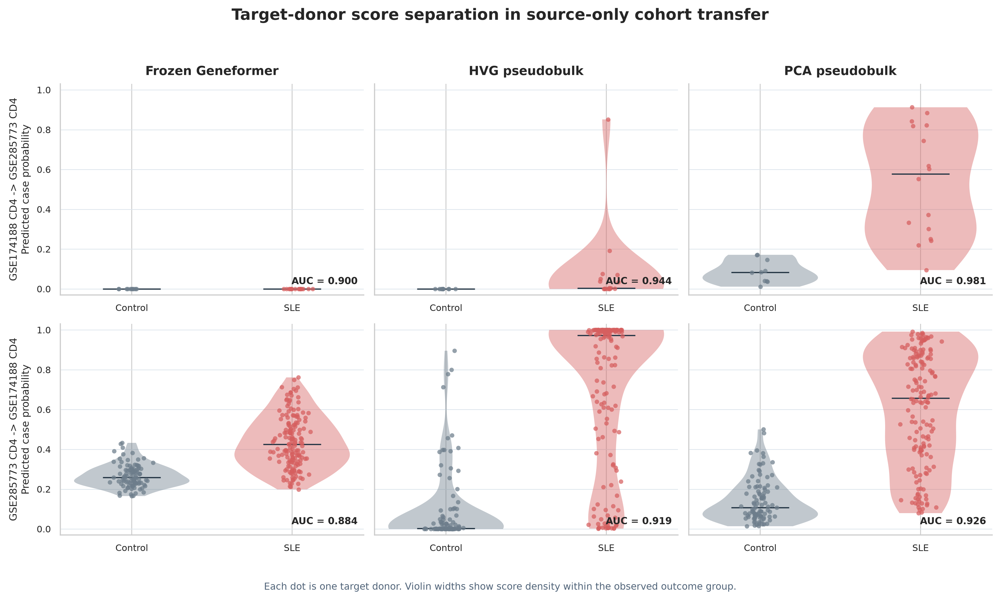

**Supplementary Figure S9. Target-donor score distributions in source-only cohort transfer.** Each dot is one target donor, with color indicating the observed outcome. The six panels show the distribution of predicted case probabilities for every transfer direction and donor representation; values are the corresponding target-cohort ROC-AUCs.

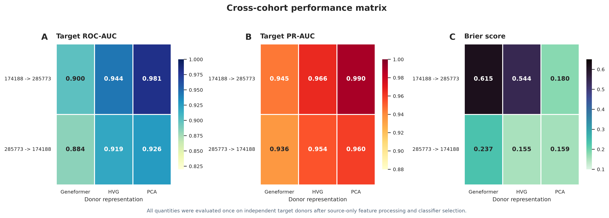

**Supplementary Figure S10. Cross-cohort performance matrix.** ROC-AUC, PR-AUC, and Brier score are shown for the six source-only transfer evaluations. Each quantity was calculated on the independent target cohort after source-cohort feature processing and classifier selection.

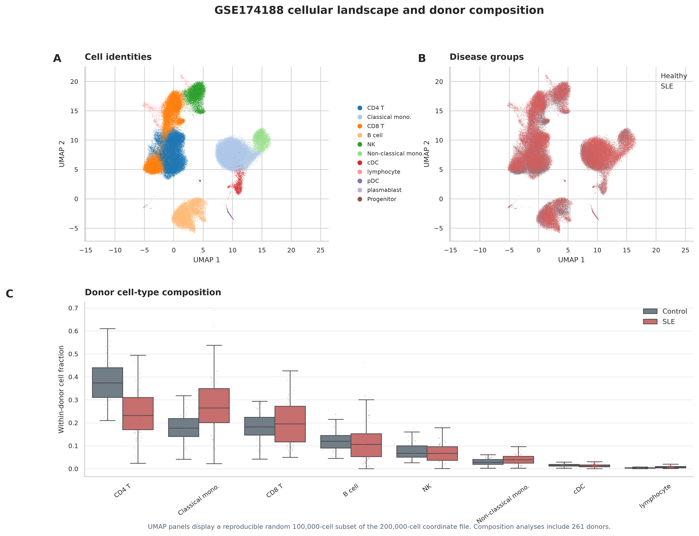

**Supplementary Figure S11. GSE174188 cellular landscape and donor composition.** Panels A-B show a reproducible random 100,000-cell subset of the 200,000-cell UMAP coordinate resource colored by cell identity and disease group. Panel C descriptively summarizes the eight most abundant cell types across 261 donors. This whole-PBMC landscape is not used as a matched CD4-only classifier baseline.

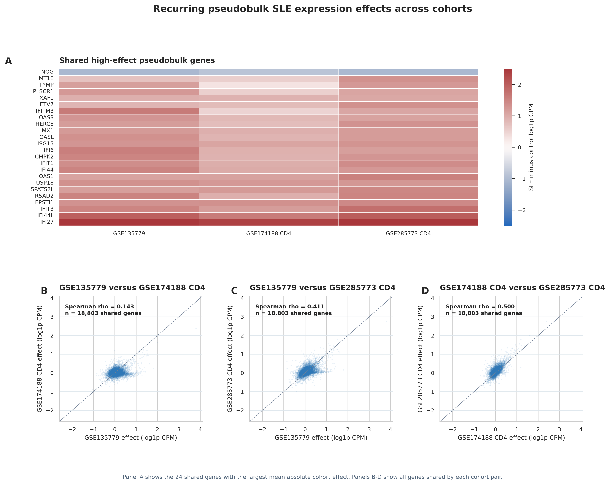

**Supplementary Figure S12. Recurring pseudobulk SLE expression effects across cohorts.** Panel A displays the 24 genes with the largest mean absolute SLE-minus-control log1p CPM difference among genes shared by all three cohorts. Panels B-D display full shared-gene effect-size comparisons for each cohort pair.

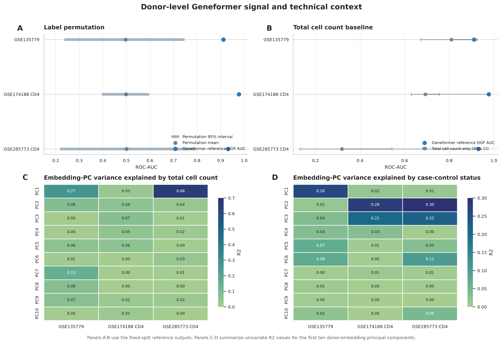

**Supplementary Figure S13. Donor-level Geneformer signal and technical context.** Panel A contrasts fixed-split Geneformer AUCs with label-permutation distributions. Panel B displays total-cell-count and Geneformer AUCs. Panels C-D show univariate R2 values for the first ten donor-embedding principal components explained by total cell count and case-control status.

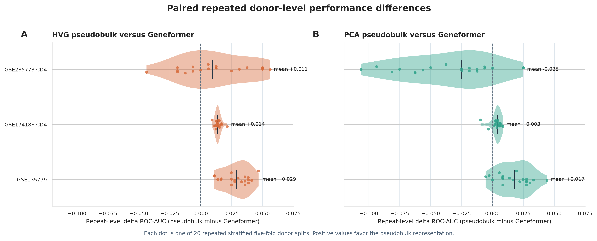

**Supplementary Figure S14. Archived unscaled fixed-C paired performance differences.** Each point is one of 20 repeated stratified five-fold donor splits from the earlier fixed-`C=1`, unscaled implementation. Positive values indicate a higher ROC-AUC for the pseudobulk representation than for Geneformer on the same donor split. This panel is retained to show preprocessing sensitivity; the fold-scaled, inner-tuned analysis is primary and is reported in Figure 2, Table 1, and Supplementary Table S20.

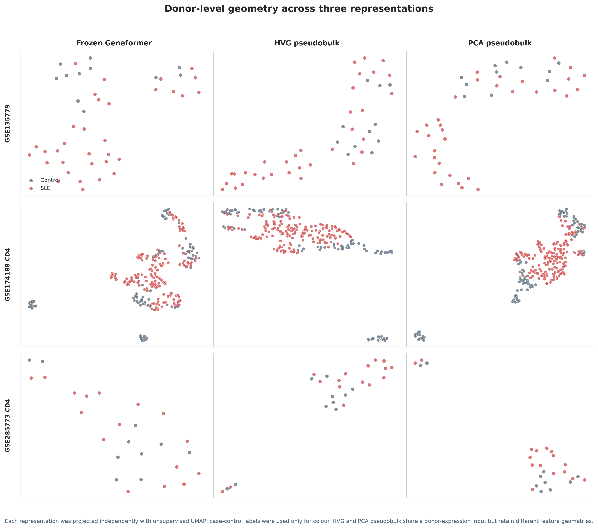

**Supplementary Figure S15. Donor-level representation geometry.** Each donor is projected from its full Geneformer, HVG-pseudobulk, or PCA-pseudobulk representation in an independently fitted, label-blind UMAP. Case-control labels are used only for color. The panel is descriptive and visualizes each representation's donor geometry rather than a supervised decision boundary.

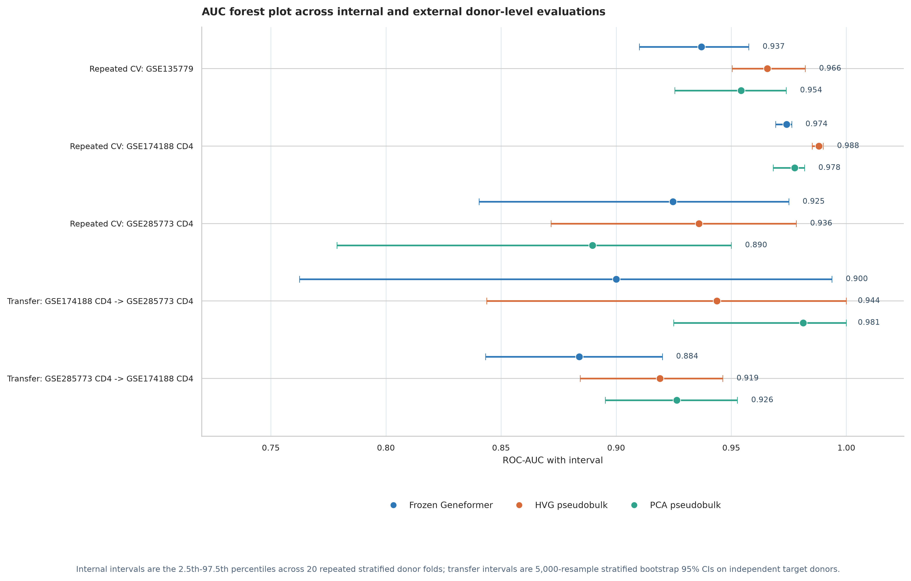

**Supplementary Figure S16. Archived fixed-C AUC forest and external evaluations.** The panel combines the earlier unscaled fixed-`C=1` internal summaries with the two strict source-only transfer directions. Internal intervals are the 2.5th-97.5th percentiles over 20 repeated donor-fold analyses; transfer intervals are 5,000-resample donor-stratified bootstrap 95% confidence intervals. The internal portion is an implementation sensitivity, not the final fold-scaled ranking.

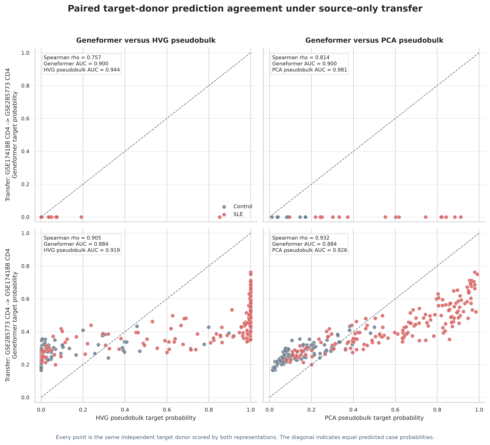

**Supplementary Figure S17. Paired target-donor score agreement.** Each point is one independent target donor scored by Geneformer and by the indicated pseudobulk representation under the same source-only transfer model. The diagonal indicates equal predicted probabilities; annotations give target-donor rank correlation and ROC-AUCs.

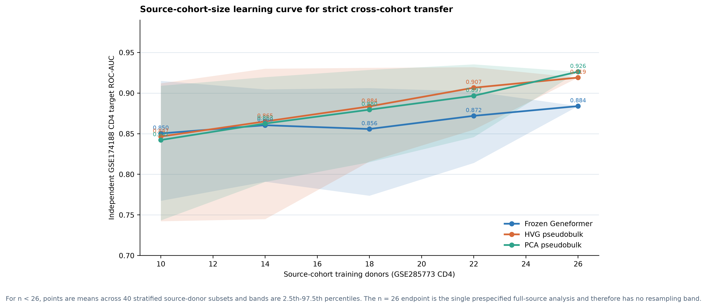

**Supplementary Figure S18. Source-cohort-size learning curve for strict transfer.** GSE285773 CD4-positive donors were repeatedly subsampled at n=10, 14, 18, and 22, with feature selection, scaling, PCA, and logistic-regularization selection repeated within each source subset. Curves report mean independent-target ROC-AUC across 40 subsets; bands are 2.5th-97.5th percentiles on the fixed 261-donor GSE174188 target. The n=26 endpoint is the single prespecified full-source analysis and has no resampling band.

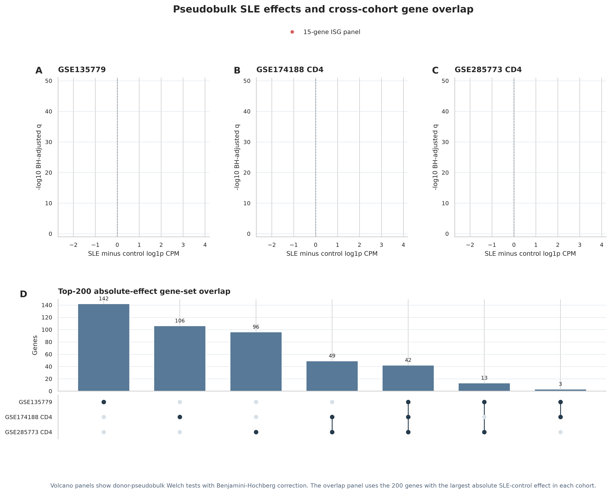

**Supplementary Figure S19. Pseudobulk volcano plots and high-effect gene overlap.** Panels A-C display donor-pseudobulk SLE-control effect sizes and Benjamini-Hochberg-adjusted two-sided Welch-test evidence. The red points are the fixed 15-gene ISG panel. Panel D is an UpSet-style display of membership in the top 200 absolute-effect genes from each cohort.

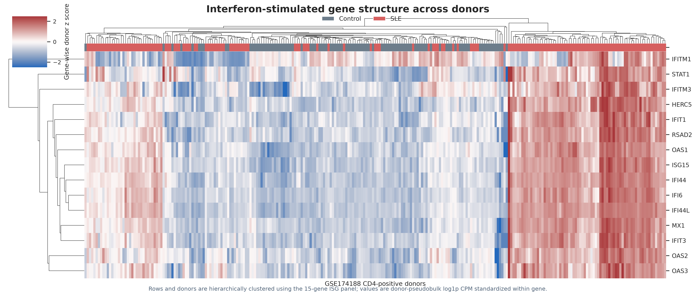

**Supplementary Figure S20. ISG expression across GSE174188 donors.** Rows and donors are hierarchically clustered using the fixed 15-gene ISG panel. Values are donor-pseudobulk log1p CPM standardized within each gene; the top annotation records the observed case-control group.

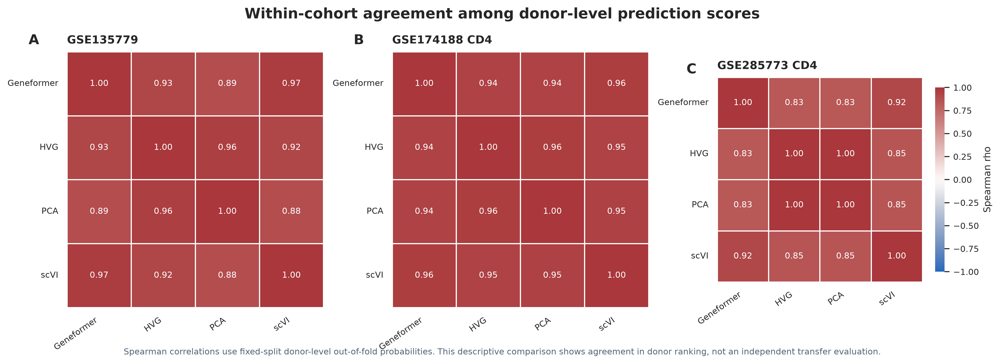

**Supplementary Figure S21. Within-cohort agreement among donor prediction scores.** Spearman correlations are calculated from fixed-split donor-level out-of-fold probabilities for Geneformer, HVG pseudobulk, PCA pseudobulk, and scVI donor means. This is a descriptive agreement analysis rather than an independent transfer comparison.

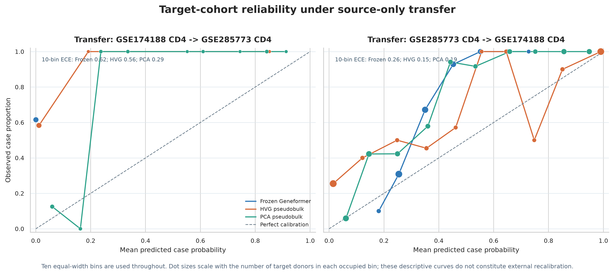

**Supplementary Figure S22. Target-cohort reliability in strict transfer.** Reliability curves use the same 10 equal-width bins as the reported ECE values; dot size indicates the number of target donors in each occupied bin. The curves are descriptive target-cohort diagnostics and do not constitute external recalibration.

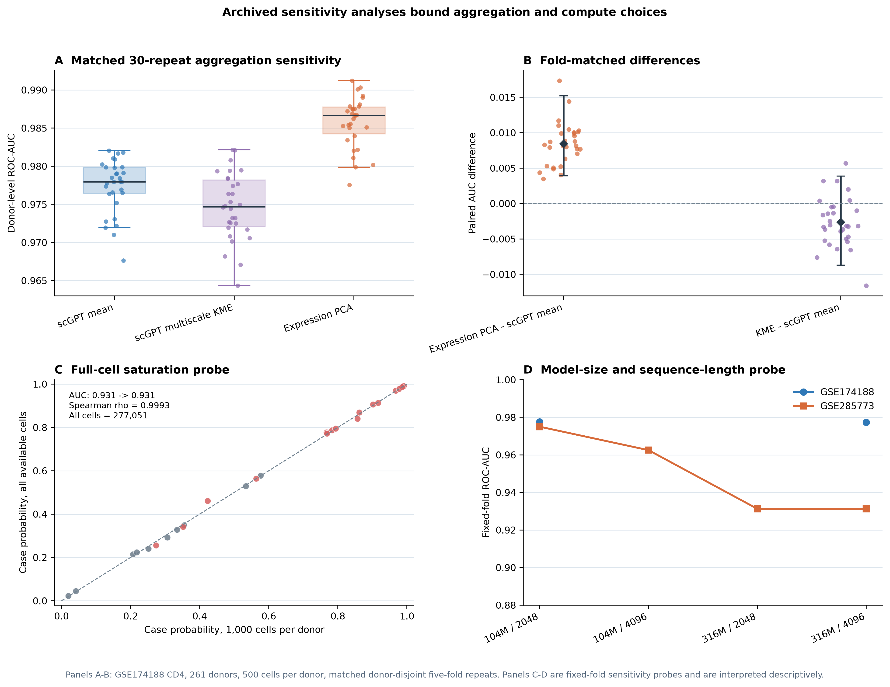

**Supplementary Figure S23. Archived aggregation and scaling sensitivities.** Panels A-B compare scGPT mean pooling, multiscale kernel mean embedding, and expression PCA across 30 matched donor-disjoint five-fold repeats in 261 GSE174188 donors. Panel C compares the 1,000-cell Geneformer run with all 277,051 available GSE285773 cells. Panel D reports the incomplete fixed-fold model-size and sequence-length grid. Repeat differences and configuration probes are interpreted descriptively.

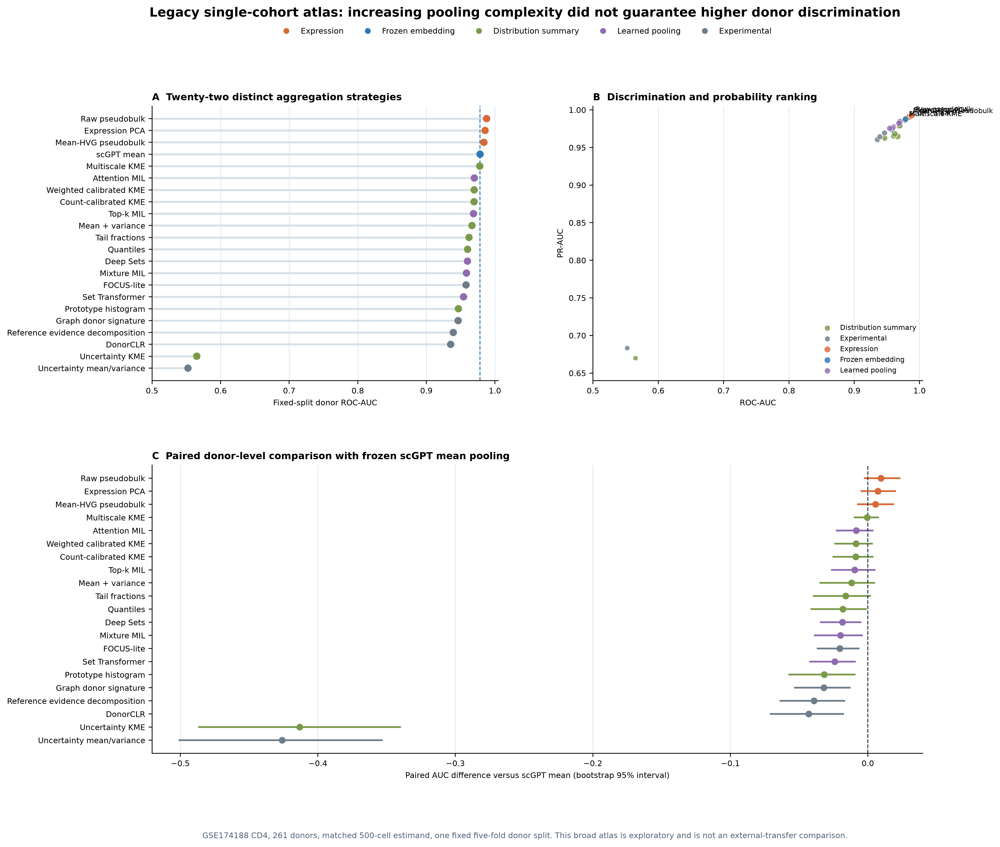

**Supplementary Figure S24. Broad fixed-split donor-pooling atlas.** Panel A ranks 22 distinct completed representations in the 261-donor GSE174188 matched 500-cell analysis. Panel B relates ROC-AUC and PR-AUC, with point area reflecting lower Brier score. Panel C shows paired donor-bootstrap AUC differences from scGPT mean pooling. Exact duplicate aliases were removed from display. The atlas uses one donor split and is exploratory rather than an external validation.

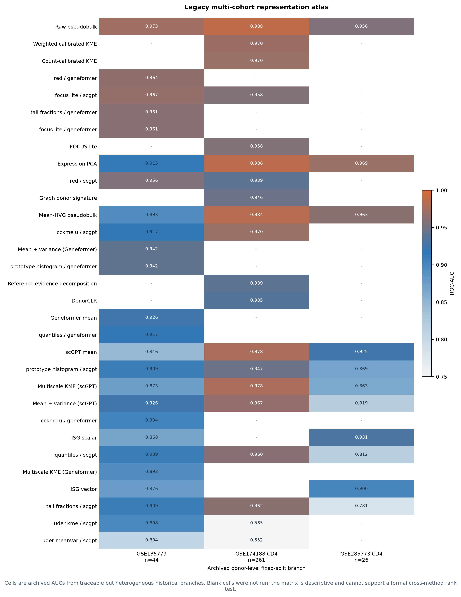

**Supplementary Figure S25. Historical multi-cohort representation atlas.** The heatmap assembles 58 traceable completed method records from GSE135779, GSE174188 CD4, and GSE285773 CD4. Blank cells denote configurations that were not run. Because fold type, model availability, and historical implementation branch differ across cells, this figure visualizes coverage and broad performance patterns but does not support formal average-rank inference.

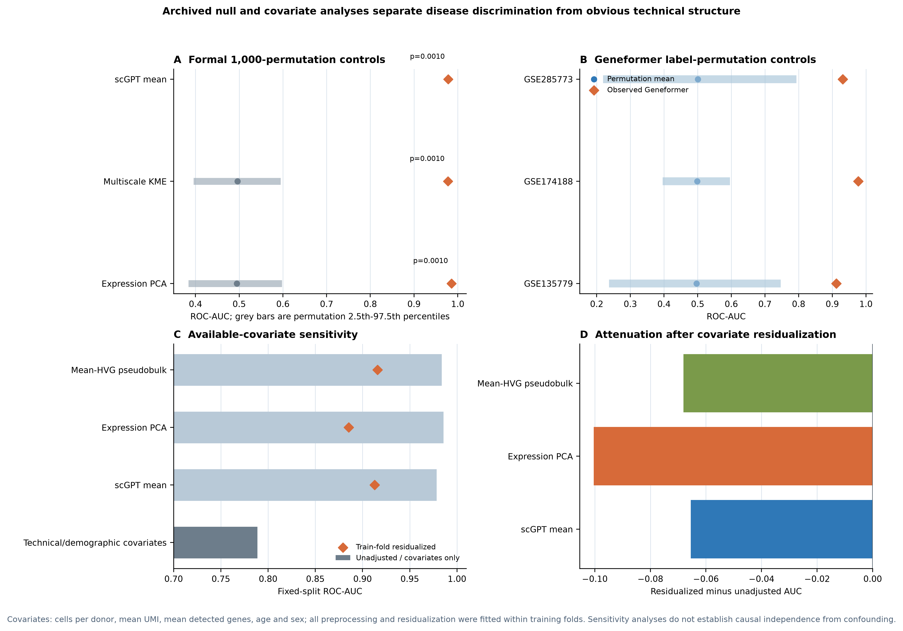

**Supplementary Figure S26. Formal null and available-covariate sensitivity analyses.** Panel A reports accepted 1,000-permutation tests for scGPT mean, expression PCA, and multiscale KME in GSE174188; the recovered scGPT record retains the accepted observed AUC and empirical p value, while its null quantiles were not present in the local snapshot. Panel B shows archived 1,000-permutation Geneformer controls in all three cohorts. Panels C-D compare fixed-split representation AUCs before and after training-fold residualization for cells per donor, mean UMI, mean detected genes, age, and sex.

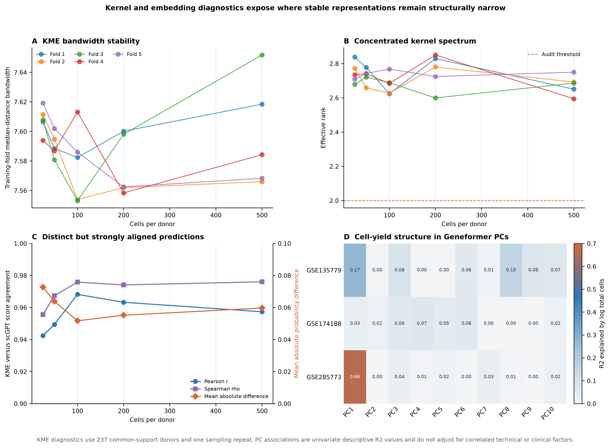

**Supplementary Figure S27. Kernel and embedding diagnostics.** Panels A-B show fold-level multiscale-KME bandwidth and effective rank across 25-500 cells per donor. Panel C compares KME and scGPT donor probabilities; no donor scores were exactly identical. Panel D shows univariate R2 values for the first ten Geneformer donor-embedding PCs explained by log total cell yield. The kernel spectrum was stable but strongly concentrated.

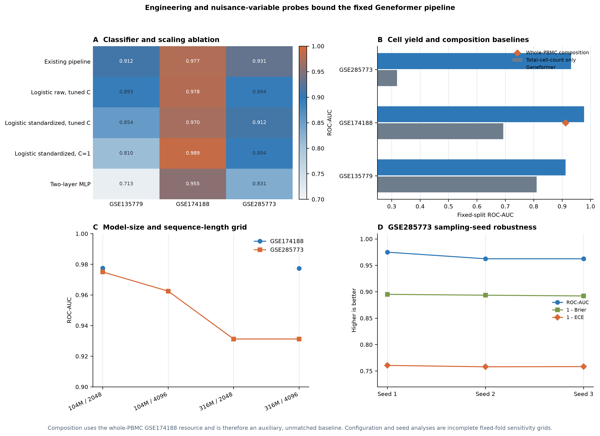

**Supplementary Figure S28. Engineering and nuisance-variable probes.** Panel A compares classifier and feature-scaling choices for fixed Geneformer donor embeddings. Panel B contrasts total-cell-count-only, Geneformer, and the auxiliary whole-PBMC cell-composition baseline. Panel C shows the incomplete model-size and sequence-length grid. Panel D compares three GSE285773 cell-sampling seeds with fixed donor folds. These panels are descriptive implementation sensitivities.

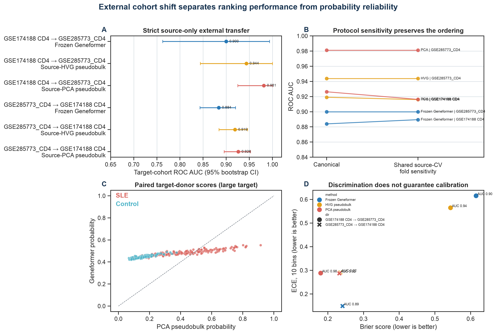

**Supplementary Figure S29. Shared-fold transfer and calibration sensitivity.** Panels A-B compare the strict source-only transfer estimates with a sensitivity in which all primary representations use the same source-internal donor folds for regularisation selection. Panel C shows paired target-donor probabilities in the larger target, and panel D contrasts discrimination with Brier score and 10-bin ECE. The larger-target pseudobulk ordering is preserved.

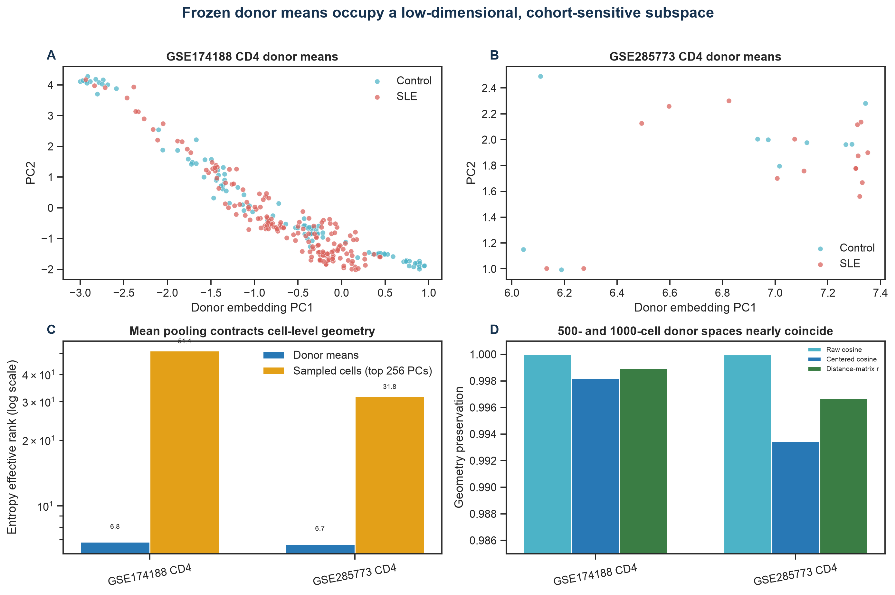

**Supplementary Figure S30. Geometry of frozen donor-mean Geneformer embeddings.** Panels A-B show label-blind donor PCA coordinates in the reciprocal-transfer cohorts. Panel C contrasts entropy effective rank at the donor and sampled-cell levels. Panel D quantifies cap500-cap1000 preservation of donor geometry. The analysis is descriptive and does not identify a causal mechanism for the transfer difference.

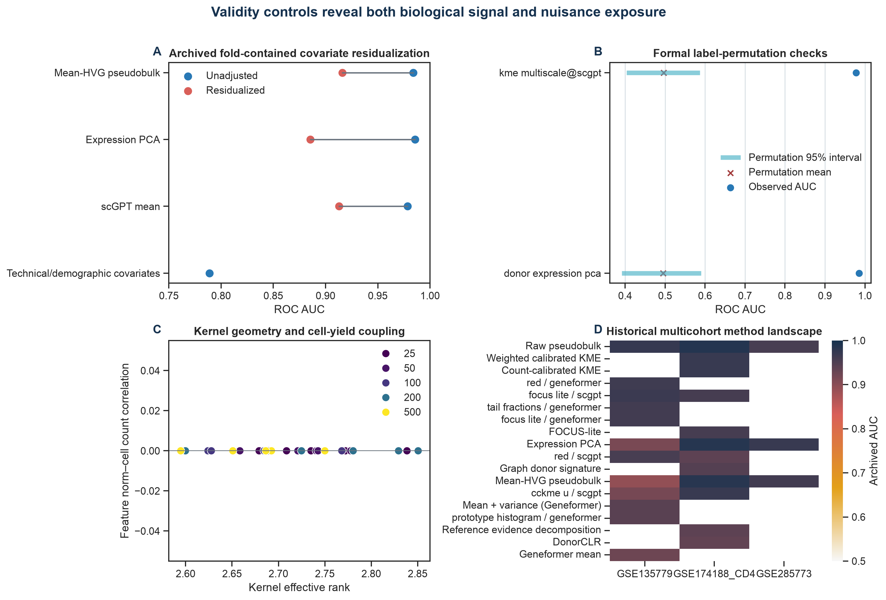

**Supplementary Figure S31. Consolidated validity controls and historical method landscape.** Panel A shows archived training-fold covariate residualization. Panel B shows accepted 1,000-permutation intervals. Panel C relates kernel effective rank to cell-yield coupling. Panel D assembles traceable historical method records. The archived branches are supporting sensitivities rather than matched primary comparisons.

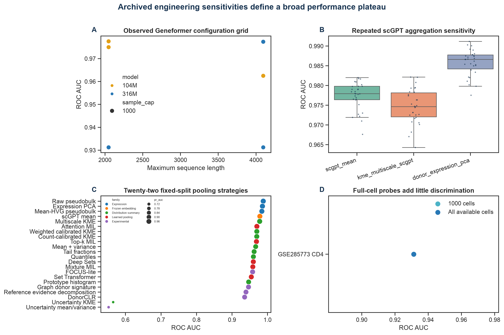

**Supplementary Figure S32. Consolidated resource and aggregation atlas.** Panels A-B show model-configuration and repeated scGPT aggregation sensitivities. Panel C ranks 22 fixed-split donor representations. Panel D compares the Geneformer 1,000-cell cap with all available cells. These engineering sensitivities define a broad plateau but do not replace the reciprocal external-transfer estimand.

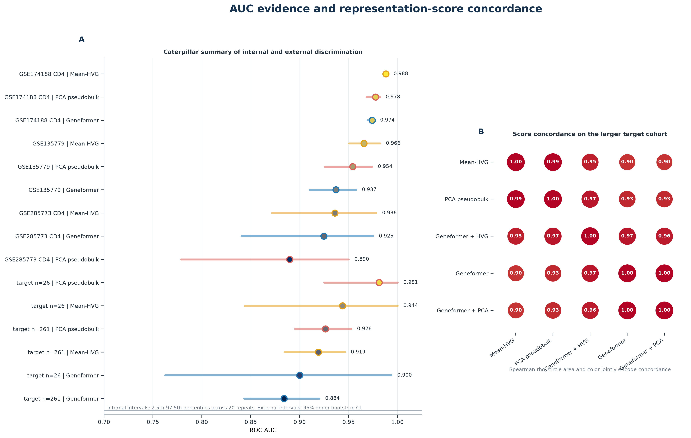

**Supplementary Figure S33. Caterpillar AUC overview and score-correlation bubble matrix.** Panel A combines repeated internal AUC distributions and external target-donor bootstrap intervals in one ordered forest display; the two interval definitions are labeled separately. Panel B shows Spearman concordance among Geneformer, pseudobulk, and early-fusion target scores in the 261-donor external cohort. Circle area and color jointly encode correlation, and the numerical coefficient remains visible in every cell.

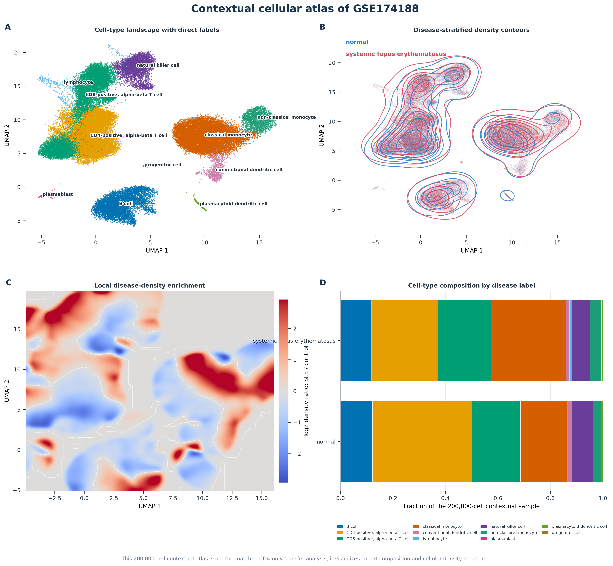

**Supplementary Figure S34. High-resolution contextual cellular atlas of GSE174188.** Panel A displays a deterministic 50,000-cell visualization sample with saturated cell-type colors and direct labels. Panel B overlays disease-stratified density contours. Panel C maps the smoothed log2 SLE-to-control density ratio, and Panel D reports exact cell-type fractions from the full 200,000-cell plot-ready table. This contextual atlas is not the matched CD4-only transfer analysis.

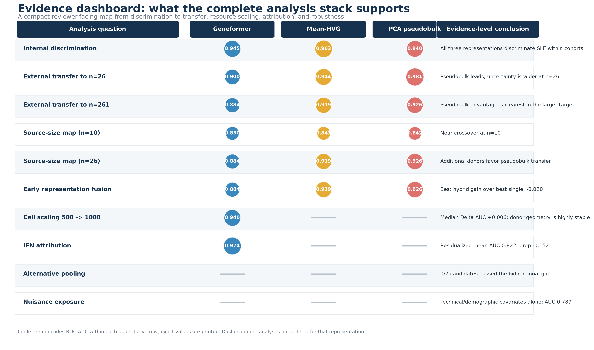

**Supplementary Figure S35. Evidence dashboard.** Quantitative rows summarize internal discrimination, both transfer directions, the source-size crossover, and early fusion. Additional rows summarize cell scaling, IFN attribution, alternative pooling, and nuisance exposure. Circle area encodes AUC within each quantitative row, exact values are printed, and dashes mark analyses not defined for a representation. The dashboard is a reviewer-facing index to the detailed result panels rather than an independent statistical analysis.
